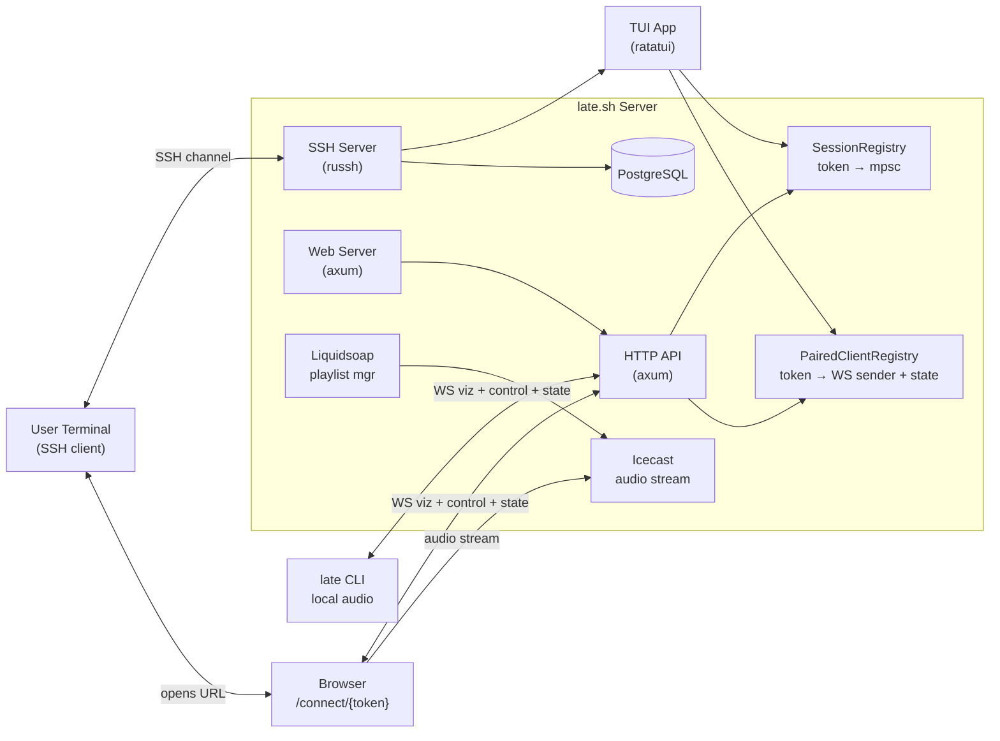
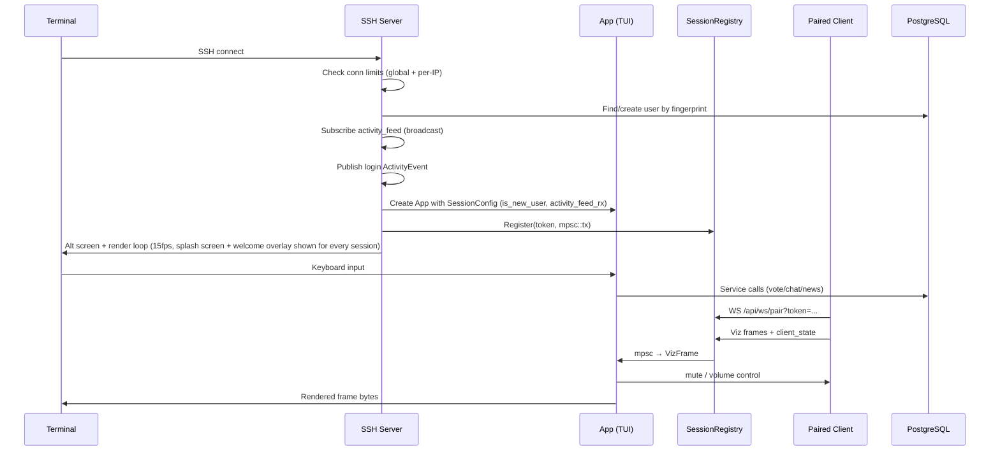
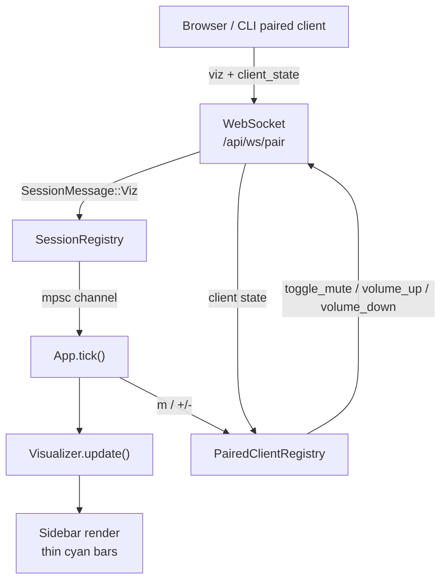
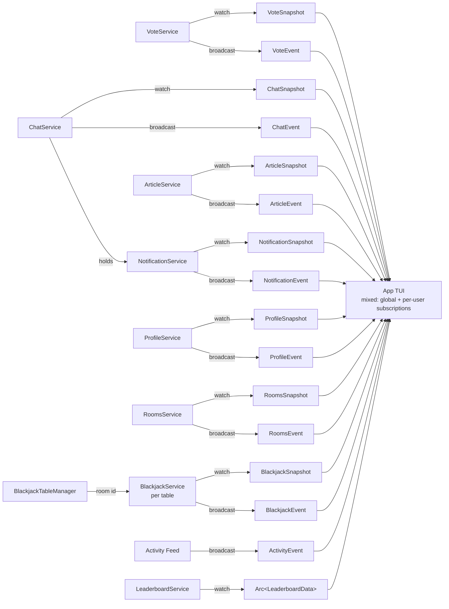
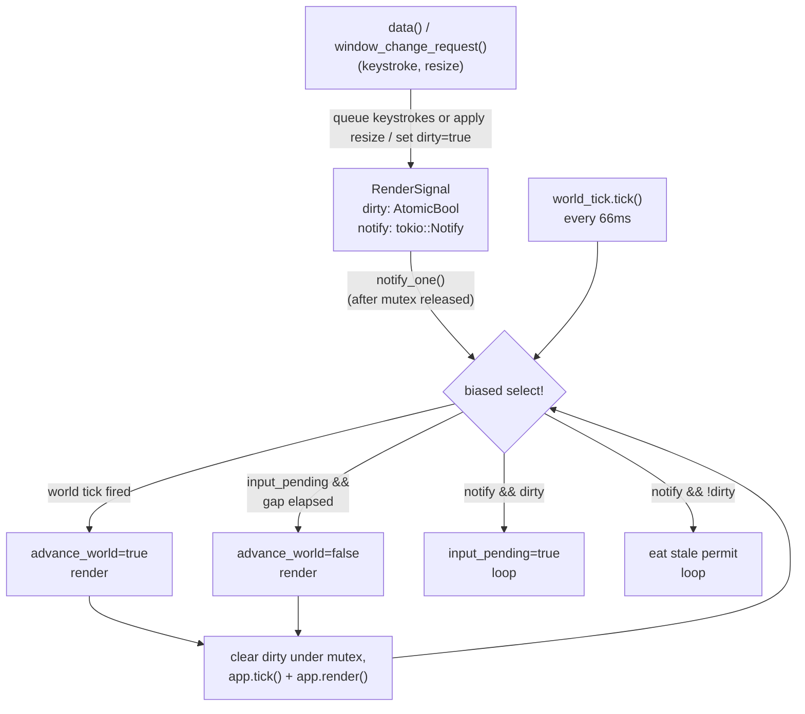
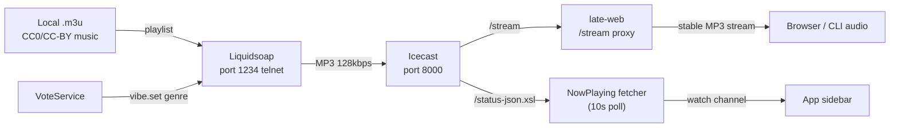
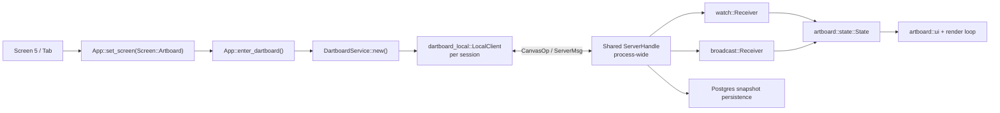

# late.sh Context

## Metadata
- Domain: late.sh - Terminal Clubhouse for Developers
- Primary audience: LLM agents working on this codebase, human contributors
- Last updated: 2026-04-26 (Rooms persistence + per-room Blackjack runtime)
- Status: Active
- Stability note: Sections marked `[STABLE]` should change rarely. Sections marked `[VOLATILE]` are expected to change often.

---

## 0. Context Maintenance Protocol (LLM-First) [STABLE]

This file is the primary working context for the entire late.sh project.

- LLM agents should treat this as a living document and update it whenever meaningful behavior changes.
- If code and this file diverge, prefer updating this file quickly so future work stays reliable.
- Temporary or branch-specific behavior should be documented here with clear cleanup notes.

### Quick update checklist
- Refresh `Last updated` date
- Review `Current Work` and `Future Work`
- Validate `Critical Invariants`
- Update telemetry references if operation/event names changed
- Remove obsolete notes

### Freshness target
- Re-review this file regularly (every 2 weeks) to prevent context drift.

---

## 1. Summary [STABLE]

> A cozy terminal clubhouse for developers. Lofi beats, casual games, chat, and tech news - all via SSH.

`ssh late.sh` and you're in. Zero friction, terminal-first, always-on vibes.

The system is a Rust workspace with four crates (`late-cli`, `late-core`, `late-ssh`, `late-web`) backed by PostgreSQL, Icecast audio streaming, and Liquidsoap playlist management.

- **Primary entry points:** SSH server (russh on port 2222), HTTP API (axum on port 4000), Web server (axum on port 3000)
- **Main responsibilities:** Multi-screen TUI over SSH (Dashboard, Chat, News, The Arcade, Rooms, Artboard), genre voting, paired browser/CLI audio control plus visualizer, real-time global chat (regular SSH chat messages support a small Markdown subset: headings, bold, italic, inline code, blockquotes, and simple `- ` list items; messages also carry simple per-user numeric reactions `1..8` rendered as footer chips beneath the message block; `---NEWS---` cards still use their dedicated renderer), link and YouTube sharing with AI summaries/ASCII thumbnails, interactive terminal games (2048, Sudoku, Nonograms, Minesweeper, Solitaire, legacy admin-gated Arcade Blackjack), a dedicated Rooms screen for persistent game-backed rooms, plus a dedicated shared multi-user ASCII artboard screen. Rooms currently supports listing Blackjack tables from `game_rooms`; admins can create/enter them and lazily bind each room to its own in-memory `BlackjackService` via `BlackjackTableManager`; the bottom chat pane is still a placeholder. Configurable right-side panels: the global app sidebar (now playing, activity, visualizer, bonsai) plus the arcade lobby leaderboard sidebar, both default-on. Global `q` now opens a quit-confirm modal; pressing `q` again exits and `Esc` dismisses it. `@bot` mention replies now receive compact context about online non-bot members in the active room (username plus optional bio/country/timezone, capped and truncated for prompt size).
- **Highest-risk areas:** SSH render loop backpressure, connection limiting, chat sync consistency, paired-client WS routing/state drift

---

## Test Strategy [STABLE]

### Scope and intent

- Cover both runtime apps: `late-ssh` and `late-web`.
- Keep most tests close to code under change (small, deterministic, focused).
- Use integration/smoke tests for boundary behavior across crates/services.

### Strict test boundary rules (required)

**Unit tests (`#[cfg(test)] mod tests` inside `src/` files):**
- MUST be pure logic only: no database, no services, no network, no async runtime required.
- Test input/output transformations, state transitions, parsing, formatting, validation math.
- If you need a `Db`, `Service`, `State`, or any I/O — it is NOT a unit test. Move it to `tests/`.
- Good examples: `rate_limit.rs` (in-memory limiter logic), `state.rs` (enum transitions), `input.rs` (key → action mapping).
- Preferred source layout for a domain is `src/.../<domain>/mod.rs` plus adjacent `state.rs`, `input.rs`, `ui.rs`, `svc.rs` as needed. `mod.rs` files must only contain `pub mod` declarations — never `pub use` re-exports.
- Keep pure unit tests inline in those source files. Do NOT create `src/.../<domain>/tests/` folders just to split unit tests.

**Integration tests (`late-ssh/tests/`, `late-web/tests/`, `late-core/tests/`):**
- MUST use testcontainers for database access — always go through `late_core::test_utils::test_db()` (or the `helpers::new_test_db()` wrapper in `late-ssh`).
- NEVER use `Db::new(&DbConfig::default())` or hardcoded connection strings in integration tests.
- `late-core::test_utils` owns shared test infrastructure: `test_db()`, `create_test_user()`. Use these everywhere instead of rolling per-test user creation — except in `late-core` model tests that are testing `User::create` itself.
- `late-ssh/tests/helpers/mod.rs` re-exports `create_test_user` from `late-core` and adds ssh-specific helpers (`test_config`, `test_app_state`, `make_app`, etc.). Domain test directories access these via `#[path = "../helpers/mod.rs"] mod helpers;` in their `main.rs`.
- Any test that touches DB, services, network, or cross-module orchestration belongs here.
- Preferred integration layout is domain-oriented under crate `tests/`, mirroring the source structure: `tests/<domain>/main.rs` with sibling `svc.rs`, `state.rs`, etc. as needed. `late-core` tests are named after their domain (`user.rs`, `vote.rs`, `chat/`).

**LLM enforcement:**
- On every code change, check: does this need a test? If yes, classify it strictly as unit or integration per the rules above.
- LLM agents must NOT run `cargo test`, `cargo nextest`, or `cargo clippy` in this repo. The human owner runs verification manually because those commands are too blocking in normal agent workflows.
- Do NOT put integration-flavored tests (DB calls, service interactions, spawning tasks) inside `#[cfg(test)]` module blocks in `src/` files.
- Do NOT invent extra source-side test directory structure when inline `#[cfg(test)] mod tests` is sufficient; reserve directory splits for crate-level integration tests under `tests/`.
- If a test is intentionally deferred (WIP/incomplete dependency), document the gap and cleanup plan in PR/context notes.

### Preferred test pyramid for this repo

1. Unit tests in module files — pure logic only, no I/O (`state.rs`, `input.rs`, `ui.rs`, `rate_limit.rs`).
2. Integration tests in `late-ssh/tests/` and `late-web/tests/` — real DB via testcontainers, shared helpers.
3. Workspace-wide checks before merge (`fmt`, `clippy`, `nextest`).

### Per-app guidance

For `late-ssh`:

- `app/*/state.rs`: unit tests for transition rules, event drains, selection/filter logic (includes profile field navigation).
- `app/*/input.rs`: unit tests for key routing and mode guards.
- `app/*/ui.rs`: unit tests for pure formatting/layout helpers only; avoid brittle pixel snapshots.
- `app/*/{mod,state,input,ui,svc,model}.rs`: keep the domain module flat and predictable; add pure unit tests inline in the relevant file instead of under `src/app/*/tests/`.
- `app/render.rs` / `app/tick.rs`: integration tests for orchestration (needs services/DB → goes in `tests/`).
- `app/*/svc.rs`: integration tests in `tests/<domain>/svc.rs` (needs real DB).
- Integration test directories mirror the source domain structure: `tests/<domain>/main.rs` with split files like `svc.rs`, `state.rs` as needed. Game tests live under `tests/games/<game>.rs`.
- `ssh.rs` / `api.rs`: smoke tests in `tests/ssh_smoke.rs` / `tests/ws_smoke.rs`.

For `late-web`:

- Handler/route behavior in `late-web/tests/*` with request/response assertions.
- Page/model transformations as unit tests under `src/pages/*` (pure logic only).
- Error mapping tests in `src/error.rs` for stable status/body behavior (pure logic only).

### Command policy

- LLM agents must not run tests or lint gates locally. Do not run `cargo test`, `cargo nextest`, or `cargo clippy`; leave all verification to the human owner.
- If code changes would normally merit verification, note the expected command(s) in handoff instead of running them.
- The human owner may still use the full CI-equivalent gate locally:

```bash
cargo fmt --all -- --check
cargo clippy --workspace --all-targets -- -D warnings
cargo nextest run --workspace --all-targets
```

### Known environment caveats

- Some integration/smoke tests require Docker/testcontainers and may fail in restricted sandboxes.
- **Temporary russh crypto dependency caveat:** `russh 0.60.1` is currently the latest crates.io release and fixes the tracked advisory, but its dependency stack pulls `pkcs8 0.11.0-rc.11`, which does not compile against final `pkcs5 0.8.0` because the PBES2 method was renamed. The lockfile pins `pkcs5` to `0.8.0-rc.13`, matching the prerelease API expected by `pkcs8`. Recheck this after the next `russh`/`pkcs8` release and remove the pin once upstream resolves cleanly.
- If a feature area is intentionally WIP, temporary lint/test gaps are acceptable only when explicitly documented and tracked for cleanup.
- **Tool bootstrap:** The repo now includes `.mise.toml` with `rust`, `mold`, and `cargo-nextest`. Prefer `mise install` before local development so the expected toolchain and test runner are available.
- **Cargo environment setup:** For local host development, use Cargo's normal defaults, including the standard repo-local `target/` directory. Docker/dev containers still use `/app/target` via container configuration. `CARGO_HOME=$HOME/.cargo` remains a valid override when an environment needs it, but it is not a repo-wide requirement.
- **`LATE_FORCE_ADMIN=1`** — dev-only escape hatch: OR'd with `users.is_admin` at session init (`late-ssh/src/ssh.rs`), so every SSH session lands as admin. Must stay `0` in prod — enforced by `required_bool` and hardcoded to `"0"` in `infra/service-ssh.tf`.

---

## 2. Architecture (with Graphs) [STABLE]

### 2.1 Component map



### 2.2 SSH session lifecycle



### 2.3 Paired client control + visualizer flow



### 2.4 Service pub/sub model



- `VoteService` (in `app/vote/svc.rs`), `ChatService` (in `app/chat/svc.rs`), `ArticleService` (in `app/chat/news/svc.rs`), and `NotificationService` (in `app/chat/notification_svc.rs`) expose shared `watch` snapshots (`subscribe_state()` / `subscribe_snapshot()`).
- `ProfileService` (in `app/profile/svc.rs`) exposes per-user `watch` snapshots backed by service-owned maps (`subscribe_snapshot(user_id)`).
- `LeaderboardService` exposes a shared `watch::Receiver<Arc<LeaderboardData>>` refreshed from DB every 30s. Contains today's champions, streak leaders, per-user streak map (used for chat badges and profile achievements), all-time high scores (Tetris + 2048), and chip leaders (top balances).
- `ChipService` (in `app/games/chips/svc.rs`) manages the Late Chips economy: `ensure_chips(user_id)` grants the daily 500-chip stipend on login, `grant_daily_bonus_task(user_id, difficulty_key)` awards 50/100/150 chips on daily puzzle completion. All 4 daily game services hold a `ChipService` clone and call it in `record_win_task()`.
- `RoomsService` (in `app/rooms/svc.rs`) owns persistent game-room creation/listing over `game_rooms` + associated `chat_rooms`, publishes `RoomsSnapshot` via `watch`, and emits `RoomsEvent` for create success/failure so session state can show banners.
- `BlackjackTableManager` (in `app/rooms/blackjack/manager.rs`) owns the process-local runtime registry `HashMap<GameRoom.id, BlackjackService>`. Entering a Blackjack room lazily calls `get_or_create(room.id)`; room creation itself only persists the room row.
- `BlackjackService` (in `app/rooms/blackjack/svc.rs`) owns one Blackjack table in-memory, publishes `BlackjackSnapshot` via `watch`, and emits per-user `BlackjackEvent` messages via `broadcast`. The SSH app's blackjack state is a thin client wrapper, not the game authority.
- Events remain `broadcast` for all subscribers; targeted variants carry `user_id` and are filtered in UI state.

### 2.5 TUI Rendering and State Architecture (Sync vs Async Boundary)

To maintain a buttery-smooth 15-60 FPS over SSH, the architecture strictly separates synchronous UI rendering from asynchronous business logic:

1. **The Setup (`ssh.rs` / `main.rs`)**
   When a new SSH client connects, a `SessionConfig` is built containing global *Services* (like `VoteService`, `ArticleService`, which hold DB pools and API keys).
2. **The Initialization (`app/state.rs`)**
   Inside `App::new()`, these services are used to create the *UI States* (e.g., `ChatState` which owns the `news::State` and `notifications::State`). Each UI State stores its `user_id`, subscribes to service channels, and spawns a per-user background refresh task (aborted on `Drop`).
3. **The Sync Loop (`app/tick.rs`)**
   Every 66ms, `App::tick()` runs. It calls `tick()` on all UI states. This:
   - Drains the channels to instantly update local memory state (e.g., `Vec<Article>`). User-targeted events are filtered by `self.user_id`.
4. **The Paint Job (`app/render.rs` -> `ui.rs`)**
   Immediately after the tick, `App::render()` runs. It passes the purely synchronous UI state directly to the draw functions. The UI just reads local memory and draws boxes. No `.await`, no freezing.
5. **The User Action (`app/input.rs`)**
   SSH keystrokes now first land in a per-session unbounded queue owned by the render task (`late-ssh/src/ssh.rs`). Right before each render, the task drains queued bytes into `App::handle_input()`, then runs `tick()` / `render()`. That keeps the input handler off the app mutex entirely for ordinary keystrokes while preserving the same synchronous UI state model. When an action requires I/O (like hitting `Enter` to save), the input handler fires a fire-and-forget method on the Service. The Service spawns a Tokio task to do the DB/API work, pushes the result to the channel, and the UI catches it on the next 66ms tick.

### 2.6 Render loop timing (world tick + input-driven)

Each SSH session spawns **one render task** (`late-ssh/src/ssh.rs`) with two independent trigger sources:

- **World tick** — fires every `WORLD_TICK_INTERVAL` (66ms). Advances animations (`app.tick()`), renders, ships the frame. Floor cadence ≈ 15 FPS regardless of input.
- **Input-driven render** — fires within `MIN_RENDER_GAP` (15ms) of any keystroke or terminal resize. Renders *without* advancing world time, so typed characters echo at near-native latency instead of waiting up to 66ms for the next world tick.

The select loop picks which branch to act on:



`biased` ordering ensures the world tick wins on ties so animations aren't starved under a keystroke flood. `next_render_action` is extracted as a standalone async fn so the decision logic is unit-testable without a full session.

#### Timing example — typing burst

```
t=0     world tick fires → render, previous_render=0, dirty=false
t=3     keystroke → dirty=true, notify_one (permit stored)
t=3+    select: notify branch → dirty=true → input_pending=true, continue
t=3+    select: sleep_until(0+15ms) armed, notify disabled
t=8     keystroke → dirty=true (already), notify_one (permit stored, branch disabled)
t=15    sleep_until fires → render covers BOTH keystrokes, dirty cleared
t=15+   select: notify branch eats leftover permit → dirty=false → nothing
t=66    world tick → render, animations advance
```

Two keystrokes → one render at t=15. No spurious trailing frame.

#### Why `dirty` is separate from `Notify`

`tokio::sync::Notify::notify_one()` stores **one** permit when no waiter is active. If `Notify` alone gated renders, permits left over from input already batched into an earlier render would fire an identical repeat frame one throttle window later. Two primitives, two jobs:

- `Notify` — alarm clock. Wakes the task.
- `dirty` — sticky note. Source of truth for "there is unrendered state".

The input path now sets `dirty` immediately after enqueueing bytes for the render task, without taking the app mutex. The render task clears `dirty` immediately before draining that queue under the mutex. Invariant: input that lands during a render flips `dirty` back to `true`, so the current frame may miss it, but the next loop iteration must pick it up.

The stored-permit regression is locked down by `ssh::tests::stale_permit_does_not_arm_throttle`; the surrounding tests cover throttle timing, `biased` wins, and the idle/active paths.

#### Scope and constraints

- **Throttle is per-session** — one session's flood can't affect another's cadence.
- **Ceiling: ~67 renders/sec per session** (`1000 / MIN_RENDER_GAP_MS`) — above smoothness threshold, below CPU-DoS territory.
- **Does not address lock contention** — the app mutex is still shared between `data()` and the render task; see §8.5 A. This change only closes the input-to-frame cadence gap, not the lock-held-across-tick stall.

### 2.7 Audio infrastructure



#### Music licensing strategy [VOLATILE]

The audio stack is local-playlist-only. Liquidsoap reads curated local `.m3u` playlists backed by files in `/music`, then streams the result through Icecast. There are no third-party live radio upstreams in the current design.

#### Source priority

Genres now use `mksafe(local_playlist)` only. Each playlist uses `mode="randomize"` + `loop=true` to shuffle all tracks and play through before re-shuffling, with `check_next` guards against back-to-back repeats at loop boundaries.

**Migration status (April 2026):**
- Lofi: **DONE** — 50 tracks, all CC0/CC-BY
- Ambient: **DONE** — 20 curated CC-BY 4.0 tracks
- Classical: **DONE** — 40 curated public-domain Musopen tracks
- Jazz: local-only for now; still the thinnest genre and a likely removal candidate

There are no live upstream radio sources in `radio.liq`.

#### Current local music library [VOLATILE]

Music binaries live in Cloudflare R2 (bucket configured via `MUSIC_BUCKET` GitHub var), synced to the Liquidsoap PVC at `/music/` during infra deploys by the `sync_music` job in `deploy_infra.yml`. Playlists are `.m3u` files in `infra/liquidsoap/` using Liquidsoap `annotate:` format and remain in git.

#### Music library [VOLATILE]

All music is CC0 or CC-BY licensed. CC-BY tracks require attribution — handled automatically via `annotate:` metadata in `.m3u` files flowing through ICY metadata to the sidebar "now playing" display.

Detailed track lists and source URLs live in [`MUSIC.md`](MUSIC.md).

- Lofi: done, 50 tracks, mixed `CC0` and `CC-BY 4.0`
- Ambient: done, 20 curated `CC-BY 4.0` tracks from Amarent, Ketsa, and The Imperfectionist
- Classical: done, 40 curated public-domain tracks from Musopen / Internet Archive
- Jazz: planned, source targets are HoliznaCC0, Kevin MacLeod, and Ketsa

Playlist generation uses curated manifests in `scripts/fetch_cc_music.py`, preserves `duration` in `annotate:` metadata, and can intentionally limit a playlist to the curated set even if older files still exist on disk.

#### Future music sources [VOLATILE]

**High-potential (verified CC0/CC-BY, not yet downloaded):**
- HoliznaCC0: 571 total tracks across ~50+ albums, all CC0. Full discography: https://freemusicarchive.org/music/holiznacc0/discography
- Ketsa: large catalog (lofi, jazz, soul, ambient, downtempo), CC-BY. Album "CC BY: FREE TO USE FOR ANYTHING" has 70 tracks: https://freemusicarchive.org/music/Ketsa/cc-by-free-to-use-for-anything
- John Bartmann: "Public Domain Soundtrack Music: Album One" (CC0) on Bandcamp
- Kevin MacLeod: 359 tracks (CC-BY): https://kevinmacleod.bandcamp.com/album/complete-collection-creative-commons
- FMA public domain search (9,000+ tracks): https://freemusicarchive.org/search?adv=1&music-filter-public-domain=1

**Not selected for the local library:**
- **Pixabay:** custom license, not ideal for a standalone music stream
- **Chad Crouch:** CC BY-NC + commercial licensing split
- **Blue Dot Sessions:** CC BY-NC only
- **Kai Engel:** mixed CC-BY/CC-BY-NC catalog, licensing instability after July 2025
- **Classicals.de:** license terms unclear

#### Music storage [STABLE]

Music binaries live in Cloudflare R2, synced to the Liquidsoap PVC during infra deploys (`sync_music` job in `deploy_infra.yml`). Git is the source of truth for playlists, licenses, and source URLs — not for binaries. ConfigMap changes (playlists, radio.liq, icecast.xml) trigger automatic rollouts via `config_hash` annotations on deployment templates — no explicit restart job needed.

#### Download tooling

- `scripts/fetch_cc_music.py` — Downloads from Bandcamp (via yt-dlp) and Internet Archive (via urllib), generates `.m3u` playlists with ffprobe metadata. Supports `--genre` and `--m3u-only` flags.
- Ambient uses a curated FMA manifest inside `scripts/fetch_cc_music.py` instead of the older broad-source ambient target.
- FMA CDN scrape pattern: FMA pages embed `fileUrl` in HTML as `https://files.freemusicarchive.org/storage-freemusicarchive-org/tracks/{hash}.mp3`. These are direct-downloadable without authentication. Extract with regex on the page source (see `/tmp/fetch_fma_tracks.py` for reference).
- Dependencies: `yt-dlp` (installed via pipx), `ffmpeg`, `ffprobe`, `python3`.

#### Metadata handling

Local playlist files retain full annotated metadata including duration (when present in ID3 tags). The `rewrite_np_metadata` function in `radio.liq` formats "now playing" as `Artist - Title | Duration` for the sidebar. Internet streams provided ICY metadata with no duration; local files may or may not have duration depending on the source.

### 2.8 Nonogram Generation and Runtime Split

Nonograms intentionally use an offline generation pipeline instead of generating puzzles during SSH sessions.

1. **Offline generation (`late-core`)**
   `late-core/src/bin/gen_nonograms.rs` generates puzzle banks by size (`10x10`, `15x15`, `20x20`), applies per-size difficulty profiles (`10x10` easy, `15x15` medium, `20x20` hard), validates every accepted candidate with `number-loom`, regenerates until each pack reaches the requested count, and writes only the final JSON assets (validation scratch files are cleaned up automatically).
2. **Shared schema (`late-core`)**
   `late-core/src/nonogram.rs` owns the portable JSON contract (`NonogramPuzzle`, `NonogramPack`, `NonogramPackIndex`), clue derivation, pack validation, and deterministic daily puzzle selection by date.
3. **Static assets (`late-ssh/assets/nonograms/`)**
   Generated packs live under `late-ssh/assets/nonograms/` with one `index.json` plus one pack file per size (`10x10.json`, `15x15.json`, `20x20.json`).
4. **Runtime loading (`late-ssh`)**
   `late-ssh/src/app/games/nonogram/state.rs` loads packs at server startup. SSH sessions only read the already-generated bank; they do not invoke `number-loom` or generate puzzles on demand.
5. **Daily selection**
   The runtime picks one puzzle per size deterministically from the prebuilt bank using the UTC date and the pack `size_key`. This keeps the "daily" experience stable without storing generator state in Postgres.
6. **Runtime persistence**
   `late-ssh` now persists one `daily` and one `personal` slot per user and `size_key` in `nonogram_games`. `d` restores the date-based daily puzzle for the selected size, `p` restores that size's saved personal board, and `n` regenerates a fresh personal puzzle from the current pack.
7. **Daily completion tracking**
   `late-ssh` also records a binary daily completion fact per user, size, and UTC date in `nonogram_daily_wins`. This is intentionally separate from board state and does not track score or time.

Current invariant:
- `late-ssh` is runtime-only for nonograms: read JSON assets, select a puzzle, render/play it, and persist per-user progress. Generation belongs in `late-core/src/bin/gen_nonograms.rs`, not in the SSH hot path.

### 2.9 Local CLI MVP

`late-cli/src/main.rs` is the standalone local launcher (companion CLI).

1. **Standalone crate** — `late-cli` has zero dependency on `late-core`. `AnalyzerConfig` is inlined so the crate can be built independently.
2. **Single-process audio path** — It opens the audio stream once, decodes MP3 locally with symphonia, feeds local playback via `cpal`, and derives visualizer/analyzer data from that same decoded stream. Native output sample rate is preferred; otherwise it chooses the nearest supported device rate and applies in-process linear resampling.
3. **SSH transport modes** — `late-cli` now has a runtime transport switch, but native is the default. `--ssh-mode old` preserves the original OpenSSH-through-pty path, while `--ssh-mode native` uses an embedded `russh` client. The old path still intercepts the one-line `LATE_SESSION_TOKEN=<base64url-uuid-v7>` banner from the PTY stream. The native path now does a dedicated `late-cli-token-v1` SSH `exec` request on a separate session channel, expects JSON `{ "session_token": "..." }`, and then opens the real PTY shell channel with no banner parsing and no fallback. In both modes stdin stays blocked until the token phase completes so pre-handshake keystrokes do not leak into the app.
4. **Identity + host trust + pairing** — Client identity remains SSH-key based, but the interactive fallback now generates `~/.ssh/id_late_sh_ed25519` natively instead of shelling out to `ssh-keygen`. Operators can override the key path with `--key` or `LATE_KEY_FILE`; if the file does not exist and the terminal is interactive, the CLI offers to generate the key at that exact path. `LATE_IDENTITY_FILE` is still accepted as a legacy env fallback. Native mode verifies server keys against `~/.ssh/known_hosts` and learns first-seen keys with accept-new semantics. The CLI then uses `/api/ws/pair` to forward analyzer frames, accept paired control commands, and report `client_state { client_kind, ssh_mode, platform, muted, volume_percent }`.
5. **Distribution + platform notes** — The landing page advertises both `curl -fsSL https://cli.late.sh/install.sh | bash` and a source build path. CLI releases go through `deploy_cli`. Audio playback is still `cpal`-based and requires a working local output device. The launcher now has a native SSH path intended to remove the hard OpenSSH dependency over time; on Unix it forwards resize via `SIGWINCH`, and on non-Unix it polls terminal size changes and emits SSH `window-change` requests. Repo helper scripts now include native-mode bash launchers plus PowerShell equivalents for local/prod flows. WSL-specific audio hints still check `DISPLAY`, `WAYLAND_DISPLAY`, and `PULSE_SERVER`.

Current invariants:
- The installer defaults to `https://cli.late.sh`, and the CLI supports `-v` / `--verbose` for stderr debug logging.
- Browser and CLI share the same paired-client protocol, so the TUI can show target kind plus live mute/volume state in the sidebar.
- The CLI currently requires a working local audio output device to fully start.
- Native SSH is now the default launcher path; `--ssh-mode old` remains the compatibility fallback. Native mode requires a server that supports the `late-cli-token-v1` SSH exec handshake.

### 2.10 Artboard (Shared ASCII Canvas) [STABLE]

`Artboard` is the user-facing name. The code and upstream crates still use `dartboard` heavily (`src/dartboard.rs`, `app/artboard/svc.rs`, `dartboard_core`, `dartboard_local`, `dartboard_editor`, `dartboard_tui`). When searching the repo, use both terms.

#### High-level model

- The artboard is a shared, persistent, multiplayer ASCII canvas on its own top-level app screen (`4`, or cycle with `Tab` / `Shift+Tab`).
- The server owns one in-proc `dartboard_local::ServerHandle` for the whole `late-ssh` process.
- The canonical canvas size is `384 x 192` (`late-ssh/src/dartboard.rs`).
- A user does **not** connect to the shared board at SSH login. They only consume a peer/color slot after opening the Artboard screen.
- Entering the Artboard screen opens in `view` mode; `i` / `Enter` switches into `active` edit mode.
- Leaving the Artboard screen drops that session's `LocalClient` and frees the slot immediately.



#### Runtime split: authoritative shared state vs local editor state

Only canvas mutations are shared. Editor affordances stay local to the current SSH session.

**Shared / authoritative**
- Canvas contents
- Peer list
- Assigned user color
- Sequence number / ack progress
- Connect rejection state
- Per-cell authorship (provenance) — map of `Pos -> username`, kept in `late-ssh/src/app/artboard/provenance.rs`. Surfaces through the ownership overlay and the Info sidebar's `Owner` / `Cell` rows.

**Local / session-private**
- Cursor and viewport origin
- Active selection anchor
- Floating brush / floating selection preview
- Swatch strip contents + pin state
- Selected paint color from the 16-color local palette (`Ctrl+U` / `Ctrl+Y`)
- Temporary sampled glyph brush
- Help overlay tab + scroll
- Glyph picker search state
- Private notice text

This split is intentional: the multiplayer protocol syncs `CanvasOp`s, not full editor sessions. Two users can have completely different local selections/swatches while painting into the same shared board.

#### Connection and service lifecycle

1. `late-ssh/src/main.rs` loads the last persisted artboard snapshot from Postgres on server boot, then spawns the persistent in-proc dartboard server.
2. `SessionConfig` carries the shared `dartboard_server` handle and shared provenance store into each SSH app instance.
3. `App::set_screen(Screen::Artboard)` lazily calls `App::enter_dartboard()`, creating a per-user `DartboardService` and `artboard::state::State`, and switching the terminal cursor to steady underline.
4. `DartboardService` calls `ServerHandle::try_connect_local(...)`. On success it spawns a dedicated OS thread that:
   - polls a local command channel every ~16ms
   - submits `CanvasOp`s to the shared server
   - drains `ServerMsg`s into a `watch` snapshot plus `broadcast` event stream
   - resolves broadcast writers to usernames and updates the shared provenance map
5. `App::tick()` calls `dartboard_state.tick()` when present, which refreshes the local snapshot, updates cursor clamping, and surfaces rejection/lag notices.
6. `App::leave_dartboard()` drops the local state and restores the normal block cursor.

Important operational note:
- Connection overflow is handled at connect time. The upstream server enforces a hard player cap (`dartboard_local::MAX_PLAYERS`); an overflow session gets `connect_rejected` instead of a live board connection.

#### Persistence model

- Runtime helper: `late-ssh/src/dartboard.rs`
- Snapshot row model: `late_core::models::artboard::Snapshot`
- Board key: `Snapshot::MAIN_BOARD_KEY`

Persistence behavior:
- The shared server boots from the last saved snapshot if one exists; otherwise it starts with a blank `384 x 192` canvas.
- Canvas saves are coalesced and persisted in the background every 5 minutes while dirty.
- A server-side UTC rollover task wakes at each UTC day boundary, archives one daily snapshot under `daily:YYYY-MM-DD`, keeps only the newest 7 daily rows, and retries the same pending rollover on failure instead of advancing the date.
- On UTC month rollover, the archived prior-day daily snapshot is also saved as `monthly:YYYY-MM`, then the live `main` board is blanked in-memory and persisted back as a fresh empty board.
- Provenance is persisted alongside the canvas in `artboard_snapshots.provenance` as JSONB. The minimal schema is username-based (`Pos -> username`), not stable user UUIDs.
- Shutdown/drain explicitly flushes the latest in-memory artboard snapshot before process exit.
- Tests cover both periodic persistence and explicit flush-on-demand (`late-ssh/tests/games/artboard.rs`).

#### Interaction model

The artboard is keyboard-first, but it is not "just type into a grid". It layers a local editor model on top of the shared canvas and now has two interaction modes:

- `view` mode: inspect the board, move the cursor/viewport, and keep global page switching (`1-5`, `Tab`, `Shift+Tab`) available.
- `active` mode: edit the board. Single-key global shortcuts are suppressed so typing goes to the canvas/editor.
- `snapshot` view: read-only historical daily/monthly archive view. `g` in Artboard view mode opens the snapshot browser; `j/k` or arrows move, `Enter` selects, the top row returns to the live board, and `g` exits an active historical snapshot back to live.
- The public web gallery for Artboard snapshots is `https://late.sh/gallery`. It is read-only: `late-web` reads `artboard_snapshots` directly from Postgres, lists `main`, `daily:*`, and `monthly:*`, renders one selected saved snapshot, and shows hovered cell coordinates / author from persisted provenance. The `main` gallery entry is the latest saved DB snapshot, not a live in-memory `ServerHandle` stream, so it can lag active drawing by the persistence interval.

```text
type chars -> draw directly
select region -> copy/cut -> swatch
activate swatch -> floating brush
Enter / ^V -> stamp brush
^⇧+arrows -> stroke floating brush
Esc -> dismiss brush/floating first, then clear selection
```

Key behaviors:
- Artboard opens in `view` mode.
- In `view` mode, arrows/Home/End/PageUp/PageDown move around the board without entering draw mode.
- `i` or `Enter` enters `active` mode.
- `g` in `view` mode opens daily/monthly snapshots; selected archives cannot enter `active` mode.
- Plain typing draws directly at the cursor.
- Typing space erases at the cursor.
- `Shift+arrows` starts/extends a selection.
- Mouse drag participates in the same editor selection/pointer model.
- `Ctrl+C` / `Ctrl+X` copy or cut the current selection into the swatch strip.
- Clicking a swatch body, or using `Ctrl+A / Ctrl+S / Ctrl+D / Ctrl+F / Ctrl+G`, activates swatch slots `1..5` as a floating brush.
- Activating the currently active swatch again toggles floating-brush transparency.
- `Enter` or `Ctrl+V` stamps the active floating brush without dismissing it.
- `Ctrl+Shift+arrows` strokes a floating brush from the keyboard.
- `Ctrl+U` / `Ctrl+Y` cycle previous/next paint color in a local 16-color palette. This affects subsequent typed glyphs, paste, glyph picker insertion, swatch stamping, and floating previews, but does not change the peer-list assigned color.
- `Ctrl+]` opens the glyph picker for emoji / Unicode glyph insertion.
- Double-clicking an existing non-space cell samples it into a temporary one-glyph brush.
- `Ctrl+P` toggles the help overlay.
- `Ctrl+\` toggles the ownership overlay. When on, cells render as per-author initials tinted by a deterministic username color derived from the provenance map.
- Selection-local shape ops now stop at `Ctrl+T` (flip selection corner), `Ctrl+B` (draw border), and `Ctrl+Space` (smart-fill). The older `Ctrl+H/J/K/L` and `Ctrl+I/O` push/pull chords are intentionally unbound; `Ctrl+U/Y` now cycle paint color.
- The Info sidebar always shows `Owner` and `Cell` for the current cursor/hover subject. The overlay only changes canvas rendering.
- `Esc` closes transient Artboard overlays first, then clears floating brush / sampled brush / selection in `active` mode, and only falls back to `view` mode once there is no local editor state left to dismiss.

Mouse-specific extras:
- Click swatch pin icon to pin/unpin a swatch.
- `Ctrl+click` a swatch body clears that swatch slot.
- Mouse wheel pans the viewport when the pointer is over the canvas.
- Mouse wheel over the info overlay is intentionally swallowed so it does not pan the board underneath.

#### Keyboard reference

| Action | Keys / Mouse | Notes |
| --- | --- | --- |
| Open Artboard | `5`, `Tab`, `Shift+Tab` | Dedicated top-level screen; entering it also connects a local client |
| Move around in view mode | `←↑↓→`, `Home`, `End`, `PgUp`, `PgDn`, mouse wheel | Lets users inspect/pan without entering draw mode |
| Enter active mode | `i`, `Enter` | Switches the screen from inspect to edit |
| Snapshot browser | `g` | View daily/monthly archives read-only; `j/k` or arrows navigate, `Enter` selects, top row returns live |
| Draw / erase in active mode | `<type>`, `Space`, `Backspace`, `Delete` | Plain typing edits the shared canvas |
| Paint color | `Ctrl+U`, `Ctrl+Y` | Previous/next local paint color; printable glyphs remain drawable |
| Select | `Shift+arrows`, mouse drag | Local selection only |
| Selection shape ops | `Ctrl+T`, `Ctrl+B`, `Ctrl+Space` | Flip corner, draw border, or smart-fill the current selection |
| Copy / cut to swatch | `Ctrl+C`, `Ctrl+X` | Fills swatch strip; does not sync to peers |
| Activate swatch brush | click swatch, `Ctrl+A/S/D/F/G` | Slots `1..5` on the home row |
| Stamp floating brush | `Enter`, `Ctrl+V` | Brush stays active |
| Stroke floating brush | `Ctrl+Shift+arrows` | Repeated stamps while moving |
| Toggle brush transparency | activate same swatch again | Floating preview shows transparency state |
| Glyph picker | `Ctrl+]` | Searchable emoji / Unicode picker |
| Help | `Ctrl+P` | Four-tab overlay (Overview / Drawing / Brushes / Session), authored in-project under `artboard/data.rs`. `Tab` / `Shift+Tab` switches tabs, `j` / `k` / arrows scroll. |
| Ownership overlay | `Ctrl+\` | Recolors cells by author initials; `Owner` / `Cell` rows stay visible in the Info sidebar either way. Backed by `provenance.rs`. |
| Return to view mode | `Esc` | Also closes help / glyph-picker before exiting edit mode |
| Leave Artboard page | `1-5`, `Tab`, `Shift+Tab` | Available from `view` mode |

#### UI and integration notes

- Artboard now lives under `late-ssh/src/app/artboard/`, not `app/games/artboard/`.
- The Artboard screen has its own renderer and does **not** use the generic game frame/sidebar layout used by the arcade games.
- The screen chrome exposes `view` vs `active` mode explicitly in both the frame title and the Artboard info sidebar.
- The artboard info sidebar shows cursor position, `Owner`, `Cell`, pan availability, selected paint color + palette row, brush status, current selection size, and connected peers.
- The Artboard help overlay mirrors the global help modal style: single-row tabs, TitleCase labels, Amber active chip, `Tab` / `Shift+Tab` switches tabs, `j` / `k` / arrows scroll. Copy lives in `artboard/data.rs` (not pulled from upstream keymap).
- The global help modal also has an `Artboard` tab. Its copy lives in `late-ssh/src/app/help_modal/data.rs` and is included in `bot_app_context()`, so `@bot` can answer common Artboard questions including daily/monthly snapshots and the web gallery URL.
- Tab-switching keybindings were unified across modals: both the global help modal and the settings modal use `Tab` / `Shift+Tab` as the canonical tab switcher; arrow/hl routing was dropped from the help modals.
- In `view` mode, global page switching stays live; in `active` mode, single-key global shortcuts are intentionally suppressed so the editor owns typing.
- The global app quit-confirm still exists, but `Esc` is reserved for backing Artboard from overlay -> view mode before any screen change.
#### Key files

- `late-ssh/src/dartboard.rs` — process-wide server + persistence wrapper
- `late-ssh/src/app/artboard/svc.rs` — per-session client/service bridge
- `late-ssh/src/app/artboard/state.rs` — local editor/session state
- `late-ssh/src/app/artboard/input.rs` — keyboard/mouse routing for active mode
- `late-ssh/src/app/artboard/page.rs` — dedicated-screen routing for view vs active mode
- `late-ssh/src/app/artboard/ui.rs` — canvas/sidebar/help/swatch rendering
- `late-ssh/src/app/artboard/data.rs` — hand-authored help text for the 4 help tabs
- `late-ssh/src/app/artboard/provenance.rs` — per-cell authorship map + ownership overlay source of truth
- `late-ssh/tests/games/artboard.rs` — service + persistence integration tests
- `late-web/src/pages/gallery/` — read-only public gallery for saved Artboard snapshots
- `late-ssh/src/app/input.rs`, `late-ssh/src/app/tick.rs`, `late-ssh/src/app/render.rs` — SSH app integration points

---

## 3. File Tree (Curated) [STABLE]

```text
late-sh/
├── Cargo.toml                  # Workspace: late-cli, late-core, late-ssh, late-web
├── CONTEXT.md                  # This file
├── OPEN_README.md              # README for the public mirror repo
├── docker-compose.yml          # Dev stack: ssh, web, postgres, icecast, liquidsoap
├── Makefile / Dockerfile       # Local dev + image build entry points
├── scripts/                    # Seed helpers, local CLI runner, CLI artifact builder
├── late-core/
│   └── src/
│       ├── db.rs               # DB pool + migrations
│       ├── model.rs            # model! + user_scoped_model! macros
│       ├── models/             # Core DB-backed domain entities
│       ├── nonogram.rs         # Shared pack schema, clue derivation, daily selection
│       ├── rate_limit.rs       # Sliding-window per-IP limiter
│       └── test_utils.rs       # testcontainers DB helpers
├── late-ssh/
│   ├── src/
│   │   ├── main.rs             # Starts SSH + API + background loops
│   │   ├── ssh.rs              # russh server + render loop
│   │   ├── api.rs              # /api/* + /api/ws/pair
│   │   ├── session.rs          # SessionRegistry + PairedClientRegistry
│   │   ├── state.rs            # Shared app state, activity, presence
│   │   └── app/
│   │       ├── ai/             # AI services: bot/graybeard + summarization
│   │       ├── bonsai/         # Persistent bonsai tree state, service, and UI
│   │       ├── chat/           # Rooms, messages, mentions, and embedded news feed
│   │       ├── dashboard/      # Landing screen layout + shortcuts
│   │       ├── games/          # Arcade hub, leaderboards, and game subdomains
│   │       ├── icon_picker/    # Ctrl+] emoji + nerd font overlay (chat composer only)
│   │       ├── profile/        # Username/profile settings and stats
│   │       ├── rooms/          # Persistent game-room directory + room-backed Blackjack runtime
│   │       └── vote/           # Genre vote state, service, and Liquidsoap control
│   ├── assets/nonograms/       # Prebuilt puzzle packs
│   └── tests/                  # Integration/smoke tests grouped by feature
├── late-cli/
│   └── src/                    # Standalone CLI: main + config, identity, raw_mode, pty, ssh, ws, audio/{decoder,resampler,output,decoder_thread,analyzer}
├── late-web/
│   ├── src/
│   │   ├── main.rs / lib.rs    # Web entrypoint + router
│   │   ├── config.rs           # Web config
│   │   ├── error.rs            # App error mapping
│   │   └── pages/              # Landing, connect flow, stream proxy, dashboard
│   └── static/                 # Tailwind output/source
└── infra/
    ├── icecast/icecast.xml     # Icecast config
    └── liquidsoap/             # Radio config + local fallback playlists
```

---

## 4. Core Contracts [STABLE]

### 4.1 Public/API contracts

**SSH API (late-ssh, port 4000):**
- `GET /api/health` - DB health check
- `GET /api/now-playing` → `NowPlayingResponse { current_track, listeners_count, started_at_ts }`
- `GET /api/status` → `StatusResponse { online, message, version }`
- `GET /api/ws/pair?token={token}` - WebSocket upgrade for paired browser/CLI control + viz

**WS payloads (client → server):**
- `{ "event": "heartbeat" }`
- `{ "event": "viz", "position_ms": u64, "bands": [f32; 8], "rms": f32 }`
- `{ "event": "client_state", "client_kind": "browser" | "cli", "muted": bool, "volume_percent": u8 }`

**WS payloads (server → client):**
- `{ "event": "toggle_mute" }`
- `{ "event": "volume_up" }`
- `{ "event": "volume_down" }`

**Web routes (late-web, port 3000):**
- `GET /` - Landing page: late.sh branding, `ssh late.sh` CTA (click-to-copy), feature list, now-playing/listeners via htmx
- `GET /{token}` - Audio pairing page: WS connection to terminal session, local audio playback, paired mute/volume control, Web Audio analyzer for TUI visualizer, now-playing via htmx
- `GET /status?pairing={bool}` - htmx fragment: now-playing track + listener count (fetched from SSH API internally). `pairing=false` for landing footer, `pairing=true` for pairing detail view. Polled every 5s.
- `GET /dashboard` - Live metrics page (HTMX, internal/testing)
- `GET /test` - Error simulation endpoint
- All other routes → redirect to `/`

**Service stream contracts (internal):**
- `VoteService::subscribe_state()` (in `app::vote::svc`), `ChatService::subscribe_state()` (in `app::chat::svc`), `ArticleService::subscribe_snapshot()` (in `app::chat::news::svc`), `NotificationService::subscribe_snapshot()` (in `app::chat::notification_svc`) → shared `watch::Receiver<...Snapshot>` (durable latest state)
- `ProfileService::subscribe_snapshot(user_id)` → per-user `watch::Receiver<...Snapshot>` (durable latest state)
- `ProfileService::prune_user_snapshot_channel(user_id)` → explicit cleanup hook called from UI state `Drop`; removes idle per-user snapshot senders
- `LeaderboardService::subscribe()` → `watch::Receiver<Arc<LeaderboardData>>` (shared, refreshed every 30s from DB; contains today's champions, streak leaders, per-user streak map for badge computation)
- `subscribe_events() → broadcast::Receiver<...Event>` - transient events/notices

### 4.2 Auth and scope model

- **Identity:** SSH key fingerprint → `users` table (`User::find_by_fingerprint`)
- **Open access:** `LATE_SSH_OPEN=true` enables auth, but only public-key auth is accepted; password and keyboard-interactive are always rejected
- **User scoping:** Votes are scoped to `user_id` (FK to `users.id`)
- **Chat scoping:** Rooms visible via membership (`ChatRoom::list_for_user`, `ChatRoomMember`)
- **Auto-join:** Public rooms with `auto_join=true` are seeded for a user only when the user record is first created; reconnecting does not re-add rooms the user already left. Permanent/admin room creation still bulk-adds all existing users when the room is created/promoted.
- **Multi-tenant isolation:** All user data queries filter by `user_id`; no cross-user reads

### 4.3 Data model and key enums

**Entities (all use UUID v7 PKs, `id`/`created`/`updated` built into `model!` macro, lists default to `ORDER BY created DESC`):**

| Entity | Table | Key constraints |
|--------|-------|----------------|
| User | `users` | `fingerprint` UNIQUE; `username` trimmed length 1-32, case-insensitive UNIQUE via `idx_users_username_lower`, format `^[A-Za-z0-9._-]+$` and no `@` (canonical public handle); `settings` JSONB holds `ignored_user_ids: [uuid]` (keyed by id, not username, so renames don't drop ignores), `theme_id` (string), `enable_background_color` (bool), `show_right_sidebar` (bool, default-on when absent), `show_games_sidebar` (bool, default-on when absent), `notify_kinds: [text]` (desktop-notification opt-ins: `dms`, `mentions`, `game_events`), `notify_cooldown_mins` (int ≥ 0; 0 = no throttle) |
| Vote | `votes` | `user_id` UNIQUE (one vote per user per round) |
| ChatRoom | `chat_rooms` | `kind` IN (general, language, dm, topic), complex constraints |
| ChatRoomMember | `chat_room_members` | PK `(room_id, user_id)`, `last_read_at` |
| ChatMessage | `chat_messages` | `body` 1-2000 chars |
| Article | `articles` | `url` UNIQUE, `user_id` FK |
| ArticleFeedRead | `article_feed_reads` | `user_id` PK/FK, per-user news read checkpoint |
| Notification | `notifications` | `user_id`+`actor_id` FK to users, `message_id` FK to chat_messages, `room_id` FK to chat_rooms, `read_at` nullable, CHECK(user_id<>actor_id) |
| SudokuDailyWin | `sudoku_daily_wins` | `UNIQUE(user_id, difficulty_key, puzzle_date)`, score tracked |
| NonogramDailyWin | `nonogram_daily_wins` | `UNIQUE(user_id, size_key, puzzle_date)`, binary completion |
| MinesweeperGame | `minesweeper_games` | `UNIQUE(user_id, difficulty_key, mode)`, stores seeded mine_map + player_grid + lives (3-life system) |
| MinesweeperDailyWin | `minesweeper_daily_wins` | `UNIQUE(user_id, difficulty_key, puzzle_date)`, best score (lives remaining) retained |
| SolitaireGame | `solitaire_games` | `UNIQUE(user_id, difficulty_key, mode)`, stores seeded stock/waste/foundations/tableau |
| SolitaireDailyWin | `solitaire_daily_wins` | `UNIQUE(user_id, difficulty_key, puzzle_date)`, best score retained |
| BonsaiTree | `bonsai_trees` | `user_id` UNIQUE, growth_points, last_watered DATE, seed BIGINT, is_alive BOOLEAN |
| BonsaiGrave | `bonsai_graveyard` | `user_id` FK (not unique — multiple deaths), survived_days, died_at |
| BonsaiDailyCare | `bonsai_daily_care` | `UNIQUE(user_id, care_date)`, UTC daily care row with watered flag, generated branch goal, cut branch ids, and one-shot water/prune penalty flags |
| UserChips | `user_chips` | `user_id` PK/FK, `balance` BIGINT (floor=100), `last_stipend_date` DATE |
| GameRoom | `game_rooms` | Generic game-room registry. `id` UUIDv7, `chat_room_id` UNIQUE FK to `chat_rooms`, `game_kind` TEXT, `slug` UNIQUE, `display_name` non-empty, `status` IN (`open`, `in_round`, `paused`, `closed`), `settings` JSONB, optional `created_by`. `GameKind` is a Rust enum over text, not a Postgres enum. |

**Key enums:**
- `Genre`: `Lofi`, `Classic`, `Ambient`, `Jazz` (vote/service/liquidsoap)
- `Screen`: `Dashboard`, `Chat`, `Games`, `Rooms`, `Artboard` (cycle: `Dashboard -> Chat -> Games -> Rooms -> Artboard -> Dashboard`; News and Mentions are synthetic room-like entries within Chat, not separate screens, each with their own persisted unread state)
- `ChatRoom.kind`: `general` (slug=general), `language` (slug=lang-{code}), `topic` (user/admin created), `dm` (canonical user pair)
- `ChatRoom.visibility`: `public`, `private`, `dm`
- `GameKind`: Rust enum in `late-core::models::game_room`; currently `Blackjack`. Persisted as `TEXT` in Postgres to keep future game-kind changes/migrations simple.

### 4.4 Error model

- **Service errors:** Propagated via `anyhow::Result`, surfaced as `VoteEvent` / `ChatEvent` error variants
- **Chat:** `SendSucceeded` / `SendFailed` with `request_id` for composer feedback
- **Votes:** `VoteEvent::Error { user_id, message }` for unknown user
- **SSH:** Connection rejected on limit exceeded; render frame drops logged
- **Web:** `AppError::Internal` / `AppError::Render` → HTTP 500 with template fallback

---

## 5. Telemetry and Observability [STABLE]

- **Architecture:** 100% native OpenTelemetry (OTLP) pipeline powered by `opentelemetry` and `tracing` crates, routed through an OpenTelemetry Collector into a pure VictoriaMetrics backend.
- **Traces (`VictoriaTraces`):** Distributed tracing spans generated via `#[tracing::instrument]`. The Collector automatically generates RED metrics (Rate, Errors, Duration) from these spans using the `spanmetrics` connector.
- **Service graph requirement:** VictoriaTraces must run with `--servicegraph.enableTask=true` for the Grafana service graph / dependencies view to populate from trace relationships.
- **Logs (`VictoriaLogs`):** Structured JSON logs bypassing stdout completely via `opentelemetry-appender-tracing`. Trace IDs and Span IDs are natively embedded for full cross-correlation in Grafana.
- **Metrics (`VictoriaMetrics`):** Custom metrics (e.g., counters) pushed directly via OTLP PeriodicReader, alongside the RED metrics generated by the Collector.
- **HTTP server spans:** `late-web` wraps the router with request middleware that emits `otel.kind=server` spans and records `http.request.method`, `http.route`, `url.path`, and `http.response.status_code`; 5xx responses set `otel.status_code=ERROR`.
- **Trace propagation:** `late-core::telemetry::init_telemetry()` installs the W3C Trace Context propagator. `late-web` injects trace headers on outbound `/api/now-playing` requests, and `late-ssh` extracts incoming headers on API requests so cross-service traces can form real parent/child relationships.
- **Dashboard playground metric:** The interactive dashboard counter posts to `/dashboard/counter`, which emits `dashboard_counter_actions_total{action=...}` for Grafana testing.
- **Grafana provisioning invariant:** The metrics datasource uses the stable UID `victoriametrics`; provisioned dashboards must reference that UID instead of Grafana-generated datasource IDs.
- **Console Output:** Local dev uses `tracing_subscriber::fmt` with `RUST_LOG=info,late_web=debug,late_ssh=debug,late_core=debug`.
- **DB health:** `GET /api/health` endpoint, `Db::health()` method
- **Connection counts:** Per-IP tracking in `State.conn_counts`, global via semaphore. When `LATE_SSH_PROXY_PROTOCOL=true`, SSH per-IP limits use the client IP from PROXY protocol.
- **Presence/listener count source:** TUI sidebar online/users and `/api/now-playing.listeners_count` both use `State.active_users`.

---

## 6. Current Work [VOLATILE]

In progress:
- Rooms is now the primary multiplayer table-game entry point (`Screen::Rooms`, key `4`).
- `RoomsService` can create persistent Blackjack tables in `game_rooms` while also creating/associating a `chat_rooms(kind='game')` row in one SQL CTE. Room creation publishes a snapshot refresh plus `RoomsEvent` success/error.
- Rooms page supports selecting rows, admin-only room creation/entry, and returning to the list with `Esc`. Active room mode is a dedicated input-capture surface: after modals and global `Ctrl-O`, events are consumed by the game/room and do not leak to app-wide hotkeys (`w`, `P`, `?`, `1-5`, `Tab`, etc.).
- `BlackjackTableManager` lazily maps each entered Blackjack `GameRoom.id` to its own runtime `BlackjackService`. Server restart drops runtime table state; entering an existing room creates a fresh service for Blackjack. Future games that need durability (Chess/Battleship/etc.) should restore from game-specific persisted state inside their manager.
- Active Blackjack room top half renders the real Blackjack UI. The bottom chat half is still a placeholder showing the associated `chat_room_id`.
- Blackjack gameplay is still single-player table logic internally. Next active task: seats and multi-seat table state.

Future:
- **Nonograms (v2)**: Replace random generation with pixel-art-to-nonogram pipeline or bulk-curate from webpbn.com.
---

## 7. Future Work & Roadmap [VOLATILE]

1. Chat upgrades: DMs/private rooms, invites/moderation, better backlog pagination

Known gaps/risks:
- Online/listener metrics are app-level presence (`active_users`, includes @bot and @graybeard), not true Icecast listener analytics
- Time remaining is approximate (up to 5s polling delay on track change)
- No external metrics or alerting system
- **Single-replica assumption:** Several structures are purely in-memory and not shared across processes (see multi-replica notes below)
- **Stateful VT parsing in `late-ssh/src/app/input.rs`:** SSH input now runs through a persistent `vte::Parser`, so CSI/SS3 sequences and bracketed paste survive split russh reads instead of assuming the whole escape sequence lands in one chunk. That removes the old split-paste failure where `[200~` / `[201~` residue or embedded newlines could leak through as live keystrokes. The app still keeps two pragmatic layers on top: `is_likely_paste` heuristically treats large printable unmarked chunks as paste for terminals without bracketed paste, and `sanitize_paste_markers`/`strip_paste_markers` still scrub stored residue defensively when copying URLs from older polluted state. Standalone `Esc` is resolved on a short tick delay so split escape sequences are not mistaken for cancel keys.

Roadmap ideas:
1. Nail one addictive loop: join -> listen -> chat -> vote -> return tomorrow.
2. Pick a clear ICP first: solo devs at night vs remote teams during work hours.
3. ~~Add one "reason to come back" mechanic~~ ✓ Daily streaks + badge tiers + leaderboard. Next: daily room rituals, timed events.
4. Keep friction near zero: ssh late.sh + optional browser pairing only when wanted.
5. Measure retention early: D1/D7 return, session length, messages/user, votes/session.

### The Arcade Pipeline [VOLATILE]

**Shipped:**
- ~~Tetris (Ascii Drop)~~ ✓ Endless falling-block arcade, 15fps gravity, persisted runs, per-user high scores.
- ~~Minesweeper~~ ✓ Classic logic puzzle with daily seeded boards and personal infinite play.
- ~~2048~~ ✓ ~~Sudoku~~ ✓ ~~Nonograms~~ ✓ ~~Solitaire~~ ✓

**Table Games (active buildout):**
- **Blackjack:** Persistent rooms and per-room runtime services are live in the Rooms screen. Service owns one table's truth; clients subscribe to snapshots/events. Still missing seats, multi-player betting, turn rotation, AFK/disconnect handling, and real room-scoped chat rendering.
- **Texas Hold'em Poker (PvP):** The ultimate late-night clubhouse game. Table-scoped chat, robust turn state.

**Async 1v1:**
- **Chess:** Correspondence style — make moves at your own pace over hours/days.
- **Battleship:** Fire a shot and check back tomorrow.

**Real-time Multiplayer:**
- **Tron (Lightbikes):** 15fps grid-based survival arena.

**Card Games:**
- **Cribbage / Bridge / Thousand (Tysiąc):** Cozy trick-taking games, deep strategy.

### Monthly chip leaderboard resets
- Archive monthly chip leaders (top 3 get a permanent badge?)
- Reset balances to baseline at month end
- "Hall of Fame" display somewhere

### Strategy multiplayer (Chess, Battleship)
- No chips needed — W/L record + rating
- Async: make a move, come back later
- Game completion counts toward daily streaks
- `/challenge @user chess` in chat for matchmaking

### More casino games (Poker)
- Texas Hold'em: PvP, uses chip betting
- Needs turn management, pot logic, hand evaluation
- Higher complexity — build after Blackjack validates the chip system

### Chat-based matchmaking
- Activity feed broadcast when someone sits at an empty table
- `/play <game>` and `/challenge @user <game>` commands
- Accept/decline prompts

---

## Game category model (unified view)

| Category | Games | Win condition | Leaderboard section | Streaks | Chips |
|----------|-------|--------------|-------------------|---------|-------|
| Daily puzzles | Sudoku, Nonograms, Minesweeper, Solitaire | Solve the daily | Today's Champions | Yes | +50 bonus per completion |
| High-score | Tetris, 2048 | Personal best | All-Time High Scores | No | No |
| Casino | Blackjack, Poker (future) | Grow your chip balance | Chip Leaders | Optional | Bet and win/lose |
| Strategy | Chess, Battleship (future) | Beat opponent | W/L + Rating | Yes (game completed) | No |

### Persistent Multiplayer World (Big Bet) [VOLATILE]

An always-running game where every connected SSH session is automatically a participant. The world ticks forward whether you're watching or not — drop in, make moves, drop out, come back tomorrow.

**Direction:** 4X / trading / economy game. Think simplified space traders or terminal-scale Civilization — explore, expand, exploit, trade. Every connected user is a player in the same persistent world.

**Why it fits late.sh:**
- Always-on matches the clubhouse vibe — the world is alive when you SSH in
- Scales naturally with player count (more players = richer economy/politics)
- Gives a strong "check back tomorrow" retention loop
- Integrates with Late Chips economy
- Chat becomes strategic (alliances, trade negotiation, trash talk)

**Open design questions:**
- Turn-based (ticks every N minutes) vs real-time with rate-limited actions?
- How much can happen while you're offline? (auto-trade, passive income, vulnerability to raids?)
- Map topology: shared grid, star map, abstract network?
- Win conditions or endless sandbox?

### Bonsai Tree Enhancements
- Seasonal color shifts (real-world date), profile display for visitors, graveyard rendering on profile.
- Fancier renderer — possibly port/adapt `cbonsai` (https://github.com/mhzawadi/homebrew-cbonsai) for richer growth animation and branching.

### GitHub Notifications Widget
- Read-only dashboard widget showing PR reviews, mentions, issue updates via PAT.
- Gives solo devs a productivity reason to keep the terminal open.

### Other Ideas
- Daily/weekly rituals (lo-fi standup, shipped rollup, weekend recap)
- Ambient presence (quiet hours, listening since, typing indicator)
- Micro-collab tools (shared scratchpad, snippet paste, pairing ping)
- Cozy utilities (pomodoro, focus playlists, now-playing shoutouts)
- Community texture (rotating shoutout board, wall of thanks)
- Events (coffee breaks, AMAs, mini coding jams)
- Personalization (accent color, favorite vibe, custom tagline)

### Global-cache for cross-user chat data (future)

`ChatService::start_user_refresh_task` polls `list_chat_rooms` every 10s per SSH session. That method currently mixes per-user reads (rooms, unread counts, selected-room tail, ignore list) with two genuinely global reads: `User::list_all_username_map` (mention autocomplete) and `Tree::list_all` (bonsai glyphs for other users' chat lines). With N online users, both global queries run N times every 10s for identical results.

Pattern to steal: `LeaderboardService` — singleton background task refreshes a shared `watch::Receiver<Arc<_>>` on a fixed interval; per-user code reads the cache instead of hitting DB. Applied here, a new `ChatGlobalsService` (or similar) would publish `{ all_usernames, bonsai_glyphs }` every 10s, `list_chat_rooms` would consume the cache, and the per-user query list would shrink to only the genuinely per-user joins.

Not urgent at today's user count — the per-user refresh remains load-bearing for dropped-broadcast-event recovery (lagged `MessageCreated`/`MessageEdited`), so the task itself stays either way; only the two global queries move out.

### Multi-replica readiness (future)

Currently the SSH app assumes a single process. These in-memory structures would need to be externalized (Redis / Postgres) for multiple replicas:

| Structure | Location | Current | To externalize |
|-----------|----------|---------|----------------|
| `current_genre` / `round_id` | `VoteService::ServiceState` | In-memory, resets to Lofi on restart | Persist to DB; only one replica runs the switch timer (leader election or DB lock). During pod drain today, the old pod cancels the vote loop immediately so only the new pod keeps mutating rounds/Liquidsoap. |
| `active_users` / `conn_counts` | `State` | In-memory counters | Shared store (Redis or DB) |
| `SessionRegistry` | `session.rs` | In-memory `token → mpsc` | Stays local — sticky sessions route SSH + WS to same replica |
| Vote/Chat/Article events + snapshots, Profile per-user snapshots | `broadcast` / `watch` channels | In-process only | Postgres `LISTEN/NOTIFY` or Redis pub/sub for cross-replica fan-out |
| @bot + @graybeard chat | `GhostService` | Always-on presence + AI chat tasks; both are dedicated DB users with fixed fingerprints | Single-leader to avoid duplicate chat responses. During pod drain today, the old pod cancels bot tasks immediately. |
| Leaderboard data | `LeaderboardService` | DB-backed `watch` channel, 30s refresh | Already DB-backed; each replica runs its own refresh loop — duplicate work but no write conflict |

**Approach:** Sticky sessions (LB routes by source IP) so each SSH connection lives on one replica. Shared data via DB/Redis. Not needed yet — single replica handles thousands of concurrent SSH sessions.

---

## 8. Critical Invariants and Tricky Flows [STABLE]

### 8.1 Security/scoping invariants

- All user-data queries MUST filter by `user_id` - enforced by `user_scoped_model!` macro and explicit `_by_user` method variants
- `model!` macro hardcodes `id: Uuid`, `created: DateTime<Utc>`, `updated: DateTime<Utc>` — do NOT duplicate these in `@generated`; use `@generated` only for extra fields (e.g., `last_seen` on User)
- Chat room visibility enforced via `ChatRoom::list_for_user` (membership join) - never expose rooms user hasn't joined
- `#announcements` is read-joinable like other permanent public rooms, but only admins may post there; enforce this in the chat service send path, not only in the UI
- DM rooms canonicalize user IDs (`dm_user_a < dm_user_b` text order) to prevent duplicate DM pairs
- DM room endpoints (`dm_user_a`, `dm_user_b`) are durable even when `chat_room_members` changes: if one participant leaves a DM, the next message from the other participant re-adds both endpoints before targeted delivery. Private topic rooms do not have durable endpoints and still require explicit invites/rejoins.
- `users.username` is the canonical public handle for chat/DM lookup; SSH login seeds it from the SSH username via `User::next_available_username` (sanitizes to `[A-Za-z0-9._-]`, adds `-N` suffixes to stay unique on `LOWER(username)`)
- @bot and @graybeard bootstrap on app startup: ensure DB user with a fixed `username`, join public rooms, and insert into `active_users` (always online). Both are dedicated users with fixed fingerprints (`bot-fp-000`, `graybeard-fp-000`)
- Connection limits (global semaphore + per-IP counter) plus SSH attempt rate limit (sliding window) MUST be enforced before any auth (effective client IP is resolved from PROXY protocol when enabled)
- Chat message deletes are hard deletes; any moderation/delete path must remove rows directly rather than relying on tombstones

### 8.2 Data integrity invariants

- UUID v7 PKs (`uuidv7()` default) for time-ordered IDs across all tables
- All foreign keys use `ON DELETE CASCADE` - deleting a user cascades to all their data
- Vote table has `UNIQUE(user_id)` - one vote per user, upsert on conflict
- Chat room constraints: general must have `slug='general'`, language must have `language_code`, DM must have both user IDs with correct ordering
- `auto_join` can only be `true` for public rooms

### 8.3 High-risk end-to-end flows

**Paired client control + visualizer:**
1. Trigger: SSH PTY request creates a session token plus the inbound `SessionRegistry` route.
2. Processing: Browser or CLI connects `GET /api/ws/pair?token=...`; API registers an outbound paired-client sender/state slot in `PairedClientRegistry`.
3. Side effects: Paired client sends viz frames (66ms-ish) plus `client_state`; viz frames route through `SessionRegistry` to `App.tick()`, while `client_state` updates paired kind/mute/volume metadata in `PairedClientRegistry`.
4. Side effects: TUI `m`, `+`, and `-` send `toggle_mute`, `volume_up`, and `volume_down` back over the same WS to only the paired client for that token.
5. Failure: If the paired client disconnects, visualizer decays (rms * 0.96 per tick) and paired state disappears. If SSH disconnects, the session token unregisters on drop.

**Chat send flow:**
1. Trigger: User presses Enter in composer with non-empty text (supports multiline via `Alt+Enter` or `Ctrl+J`). If `edited_message_id` is set, the same submit path fires `edit_message_task` instead of `send_message_task`, so edit rides on the composer exactly like a fresh send.
2. Processing: `ChatService::send_message_task` spawned with `request_id` → DB insert → `MessageCreated` broadcast → `SendSucceeded` targeted to sender. Edits emit `MessageEdited` (full `ChatMessage` payload + real `target_user_ids`) plus a per-sender `EditSucceeded`/`EditFailed` ack.
3. Side effects: All sessions receive `MessageCreated`/`MessageEdited` and apply the delta to their local `rooms[room_id]` vec (no DB refetch). Messages containing `@username` show a golden `│` gutter on the left for the mentioned user.
4. Failure: Non-member send → `SendFailed` event with message. DB error → `SendFailed`. Empty edit body → `EditFailed`.
5. News articles post their "new article" announcement into #general by resolving the general room id inline in `ArticleService` and calling `send_message_task` like any other composer submit — there is no general-specific send wrapper.

**Chat ignore flow:**
1. Trigger: User submits `/ignore @user` or `/unignore @user` in the composer
2. Processing: `ChatService::ignore_user_task` / `unignore_user_task` resolves the username via `User::find_by_username`, then calls `User::add_ignored_user_id` / `remove_ignored_user_id` (settings JSONB write keyed on `target.id`, not the username string)
3. Side effects: Service emits `ChatEvent::IgnoreListUpdated { user_id, ignored_user_ids, message }`. `ChatState` updates its local `HashSet<Uuid>`, calls `refilter_local_messages()` to drop already-stored messages from any newly-ignored author across every non-DM room in place (no DB refetch), and shows a success banner.
4. Exemptions: DM rooms are never filtered — leaving the DM room is the way to dismiss it. `push_message` skips the ignore check for DM rooms so 1:1 messages always land.
5. Display path: `ChatState::ignore_list_lines()` resolves stored UUIDs back to `@username` via the snapshot's full `usernames` map (`User::list_all_username_map`), falling back to `@<unknown:…>` when a user isn't in the cache.
6. Failure: `IgnoreFailed { user_id, message }` for self-target, unknown username, already-ignored, or not-currently-ignored — surfaced as a red banner.

**Chat roster/help overlay flow:**
1. Trigger: User submits `/help`, `/active`, `/members`, or `/list` in the composer
2. Processing: `ChatState::submit_composer()` intercepts these before any message send. `/help` opens a static overlay, `/active` snapshots the shared in-memory `active_users` registry, `/members` spawns `ChatService::list_room_members_task` for the selected room, and `/list` spawns `ChatService::list_public_rooms_task`.
3. Side effects: `/active` renders usernames in an overlay immediately and annotates repeated SSH sessions as `(<n> sessions)`. `/members` resolves `chat_room_members` to `users.username` and opens a room-member overlay when the async event arrives. `/list` opens a simple public-room overlay with member counts.
4. Guardrail: `/members` still requires a real selected room; DMs are allowed and render a generic `DM Members` title.
5. Failure: Missing room selection or DB/service errors surface as chat banners via `RoomMembersListFailed` / `PublicRoomsListFailed`.

**Chat reply flow:**
1. Trigger: User selects a message (`j`/`k`) and presses `r`
2. Processing: `ChatState::begin_reply_to_selected_in_room(room_id)` captures the target author plus a short preview, enters compose mode, and shows a reply-specific composer title. Callers resolve the target room themselves (chat screen passes `selected_room_id`, dashboard passes `App::dashboard_active_room_id()` — which honors pinned favorites, see below); there is no implicit-room wrapper.
3. Side effects: Submit prepends a quoted first line (`> @user: preview`) to the stored message body; rendering peels that first line back out and draws it as faint reply context above the new body
4. Failure: No selected message → `r` is a no-op

**Dashboard favorites quick-switch:**
1. Trigger: User pins rooms via Settings → Favorites tab, stored in `users.settings.favorite_room_ids` (ordered JSONB UUID array). `Profile.favorite_room_ids` reads/writes it through `ProfileParams`.
2. Resolver: `App::dashboard_active_room_id()` picks the dashboard chat card's room — 0 pins → `#general`, 1 pin → that pin (falls back to general if the user has since left it), 2+ pins → `favorites[dashboard_favorite_index]`. Every dashboard-scoped input path (arrows, `i` compose, `c` copy, scroll, icon picker) calls this resolver instead of `general_room_id()`.
3. Strip: `App::dashboard_strip_pins()` returns `Some(pills)` only when ≥2 resolvable pins exist, and `draw_favorites_strip` renders a 1-row pill strip above the chat card. Hidden in 0/1-pin cases and when dashboard height <6.
4. Keybinds (dashboard only): `[` / `]` cycle, `,` jumps to previously-active pin (Vim `C-^` style), `g<digit>` jumps to slot 1..9. The `g` prefix is session-local state on `App`; `handle_global_key` short-circuits digits 1-9 on dashboard while armed so the global screen switcher (`1`=Dashboard, `3`=Games, …) doesn't steal them.
5. Membership churn: `SettingsModalState::open_from_profile` drops favorites whose room isn't in the current `available_rooms` catalog, so ghosts never linger in the UI. The resolver also falls back to general if a stored pin is no longer joined. Index is session-local (not persisted) and clamped on every read.

**Chat @mention autocomplete:**
1. Trigger: User types `@` in composer (at start or after space)
2. Processing: `ChatState::update_autocomplete()` filters `all_usernames` (loaded from `users` via `ChatSnapshot`) case-insensitively by the query after `@`
3. Interaction: Arrow keys navigate matches, Tab/Enter confirms (inserts `@username `), Esc dismisses popup without leaving compose mode
4. Rendering: `draw_mention_autocomplete()` renders a popup above the composer with up to 8 filtered matches; confirm must also move `composer_cursor` to the end of the inserted mention including the trailing space

**Vote round switch:**
1. Trigger: VoteService background tick (5s) detects switch interval (default 60 min) elapsed since last switch
2. Processing: `switch_to_winner()` → pick genre with most votes (or keep current) → clear all votes → increment `round_id` → send `vibe.set <genre>` to Liquidsoap
3. Side effects: All clients detect `round_id` change → clear `my_vote`. Liquidsoap switches playlist.
4. Failure: Liquidsoap TCP failure logged but round still switches locally.

### 8.4 Easy-to-break gotchas

- **Ignore is keyed by user id, not username:** `users.settings.ignored_user_ids` stores UUIDs, so a `/ignore @alice` survives @alice renaming herself to @alice2. Storing usernames there would silently break on rename and could re-attach a stale ignore to a different person if usernames are ever reused.
- **Ignore re-filter is local-only:** `ChatEvent::IgnoreListUpdated` triggers an in-place retain across every non-DM room — no `request_list()` refetch. Side effect: `unignore` does **not** retroactively re-fetch already-dropped messages; they reappear on the next natural snapshot/refresh.
- **Dashboard shares one chat store with the chat page:** #general lives inside `ChatState.rooms` like every other room; the dashboard card just looks it up by `general_room_id`. There is no parallel `general_messages` vec. Every member-room stays warm from broadcasts regardless of selection — `push_message` only gates the "mark-as-read" side effect on whether the user is actually viewing the room. **Message operations on `ChatState` are room-explicit**: the canonical methods are `select_message_in_room`, `begin_reply_to_selected_in_room`, `begin_edit_selected_in_room`, `delete_selected_message_in_room`, `start_composing_in_room`, all taking a concrete `Uuid`. There are no implicit-room variants — callers resolve the target room at the boundary. Wire new message actions *once* in three places and they work on both dashboard and chat page automatically: (a) `chat::input::handle_message_action_in_room(app, room_id, byte)` for the keybinding, (b) the room-explicit `ChatState` helpers (`find_message_in_room`, `replace_message`, `remove_message`, etc.) for state mutation, (c) `chat::ui::draw_composer_block` / `ComposerBlockView` for any new composer state label (reply, edit, …). Chat-screen entry points (`handle_message_action`, `handle_message_arrow`, `handle_scroll`) are thin wrappers that resolve `selected_room_id` at the top and delegate to the `_in_room` variant; dashboard input passes `App::dashboard_active_room_id()` directly (which equals `general_room_id()` when no favorites are pinned, otherwise the active favorite — see the "Dashboard favorites quick-switch" flow). The composer also pins its own `composer_room_id` in `start_composing_in_room` so submit never falls back to `selected_room_id` — switching rooms mid-compose can't redirect an in-flight message.
- **Message reactions are per-user and footer-scoped:** `chat_message_reactions` stores at most one numeric reaction (`1..8`) per `(message_id, user_id)`; `f` then `1..8` reacts to the selected message. Rendering keeps reactions inside the selected message block as footer chips below the body, so grouped messages still read top-to-bottom with reactions "between" adjacent messages rather than in the composer or sidebar.
- **Snapshot merge for empty rooms:** `ChatState::merge_rooms` preserves cached messages when snapshot arrives with empty message list for a room - prevents flash-clear on out-of-order snapshots
- **Unread count merge:** `merge_unread_counts` tracks `pending_read_rooms` to suppress stale unread counts after marking read (avoids flicker)
- **Render loop missed ticks:** 66ms interval with `MissedTickBehavior::Skip` - if a frame takes too long, next ticks are skipped rather than queued (prevents snowball lag)
- **SSH data timeout:** `handle.data` has 50ms timeout to avoid blocking render loop on backpressure
- **SSH send failure is terminal for render task:** if `handle.data` returns `Err` (closed/broken channel), `render_once` now returns an error so the render loop stops and closes channel once, instead of logging warnings every 66ms forever
- **Message ordering:** Full history is `ORDER BY created DESC, id DESC` (newest first), delta sync is `(created, id) > cursor ASC` - mixing these up breaks chat display. Chat rendering reverses messages to oldest-first for row-based display, with newest at the bottom.
- **Chat message navigation is selection-first:** `selected_message_id` is the source of truth on both the dashboard general card and the chat screen (they share one storage). Mouse wheel, arrows, paging, and `j/k` all move selection; when no message is selected, the viewport falls back to newest-at-bottom.
- **Chat display names are intentionally plain:** transcript author labels, DM labels, and member labels render the stored username without a leading `@` and without an appended country badge. `@` still exists in composer mentions, mention autocomplete, and command syntax (`/dm @user`, `/ignore @user`, etc.), so display formatting and mention syntax are deliberately different.
- **Chat wrapping is word-aware:** Shared wrapping prefers breaking on whitespace for regular messages, reply quote lines, small-subset Markdown chat blocks (paragraphs, headings, quotes, `- ` list items), news-card text, and the composer. Hard splits are only valid for single words longer than the available width.
- **Chat room list order is UI-defined:** The chat sidebar order is hardcoded as `core` (`general`, `announcements`, `suggestions`, any other permanent rooms, then synthetic `news`, `mentions`, `discover`) → `public` → `private` → `dm`, with divider rows rendered in the UI. Public/private sections now map directly to DB `visibility = 'public' | 'private'` for non-permanent, non-DM rooms. The synthetic `news` row carries its own unread badge sourced from `article_feed_reads`, and the synthetic `discover` row lists public topic rooms the current user has not joined yet (member/message counts + Enter-to-join).
- **Transcript render cost is cache-sensitive:** every member room keeps a warm tail (broadcast-driven, hard-capped at 1000 messages per room). The chat UI caches wrapped transcript rows for the dashboard general card and the active room; invalidation must track width, message content/order, usernames, badges, and bonsai glyphs. Only the selected room and general are fetched from DB on snapshot refresh — other rooms warm up from broadcasts and pull a one-shot backfill via `request_list` on first open per session.
- **Composer render cost is cache-sensitive:** The chat composer caches wrapped `ComposerRow`s in `ChatState`; any change to composer text or width must invalidate that cache before render/cursor-up/down.
- **Icon picker is chat-composer-only:** `Ctrl+]` (byte `0x1D`) opens `app::icon_picker` as a modal overlay, lazy-loads the catalog on first open (two sections each for Emoji and Nerd Font — no Unicode tab, no `unicode_names2` dep), and auto-starts `ChatState::start_composing` if the user isn't already composing. Selected icons are only ever pushed into `app.chat.composer`; Profile and news composers are intentionally not targets. The picker intercepts all input via an early return in `handle_parsed_input`, so while it is open nothing else on screen receives keys.
- **@mention detection:** Uses simple `@username` substring match in message body. The `all_usernames` field on `ChatSnapshot` is loaded from `users` every refresh (10s) via `User::list_all_usernames` — includes all users, not just online ones.
- **Reply persistence is currently body-encoded:** There is no reply DB column yet. Replies are stored as a quoted first line in `body` and rendered back out in the TUI. If/when true threaded metadata is added, both send and render paths need coordinated migration.
- **All services are singletons** shared across SSH sessions. `ProfileService` snapshots are per-user channels keyed by `user_id`; events still require `user_id` filtering in UI state. Per-user background refresh tasks are spawned on session init and aborted on `Drop`, and profile snapshot channels are pruned when receivers go away.
- **Chat room `updated` timestamp:** Intentionally NOT used for room ordering to keep stable sort - rooms ordered by type (general → language → private → dm)
- **Web Audio `createMediaElementSource` is one-shot:** Can only be called once per `<audio>` element. AudioContext + source node must be created once and reused across play/pause cycles. Disconnect suspends the context (`audioCtx.suspend()`), replay resumes it — never close and recreate.
- **Browser audio pairing status must not be stomped by WS:** WS `onclose`/`onerror` must check `status !== 'playing'` before setting `'disconnected'`, otherwise a WS drop kills the "streaming" UI while audio is still playing fine
- **Paired-client control routing is latest-wins per token:** `PairedClientRegistry` stores one outbound sender/state entry per session token. If multiple browser/CLI clients pair against the same token, the most recent registration owns control/state until it disconnects.
- **CLI visualizer follows audible output now:** The CLI analyzer ring must record post-mute/post-volume samples, not raw decoded samples, otherwise the TUI visualizer drifts from what the user actually hears.
- **CLI output sample-rate fallback is device-driven:** Prefer native `44.1 kHz` playback when the output backend supports it; only resample when the chosen `cpal` device config requires a different rate such as `48 kHz`.
- **Web/CLI Audio and WS Resiliency:** Both paired clients use a 10-attempt retry loop (2s delay) for WebSocket disconnections and audio stream failures. Web Audio reconstructs elements with cache-busting `?t=` URLs, and CLI re-probes `SymphoniaStreamDecoder` in place, so both recover seamlessly from `ERR_NETWORK_CHANGED` without dropping the session.
- **Browser and CLI viz payloads share schema, not implementation:** Both paired clients send `{ event: "viz", position_ms, bands, rms }`, but the browser uses Web Audio `AnalyserNode` while the CLI uses an in-process Rust FFT over playback samples. Expect similar behavior, not identical numbers.
- **CLI binary must forward local terminal resizes:** The `late` binary runs SSH inside a local PTY and must propagate `SIGWINCH` size changes into that PTY so side-by-side panes and split windows reflow correctly after startup.
- **CLI must suppress pre-token input:** The local `late` binary must not forward stdin into the interactive SSH PTY until the pairing token exchange has completed. In subprocess mode that still means waiting for the server's `LATE_SESSION_TOKEN=` banner; in native mode it means waiting for the dedicated `late-cli-token-v1` SSH exec handshake response. Any keys typed during handshake/welcome race windows are intentionally discarded, and pending terminal input is flushed immediately before forwarding starts.
- **Activity feed broadcast timing:** `broadcast::Receiver` only sees messages sent AFTER subscription. The receiver must be created in `auth_publickey` (before login event is sent), stored on `ClientHandler`, then `.take()`'d into `SessionConfig` in `pty_request`. Creating the receiver later misses the user's own login event.
- **Leaderboard refresh is async, badges are eventually consistent:** `LeaderboardService` refreshes every 30s. A new daily win won't appear in the leaderboard or chat badges until the next refresh cycle. Activity feed callouts are immediate (fire-and-forget from `record_win_task`).
- **Streak SQL uses gaps-and-islands:** A streak is "current" if its last day is today or yesterday. This means a user who hasn't played today still keeps their streak visible until midnight UTC tomorrow. The `UNION` across `sudoku_daily_wins` and `nonogram_daily_wins` deduplicates dates so playing both games on the same day counts as one streak day.
- **Game services hold `activity_feed` sender:** `SudokuService` and `NonogramService` both hold a clone of the `broadcast::Sender<ActivityEvent>` for win callouts. The username is looked up from `users` inside the fire-and-forget task (via `late_core::models::profile::fetch_username`), not passed from the caller.
- **Bonsai death check runs on login:** `BonsaiService::ensure_tree()` checks `last_watered` against UTC today on every SSH session start. If 7+ days have passed, the tree is killed and a graveyard record is created. This means death is only detected when the user reconnects, not while offline.
- **Bonsai daily care is UTC-based:** session startup ensures today's `bonsai_daily_care` row and applies unapplied penalties from prior care rows once. Missing water does not directly reduce growth, but 7+ dry days kills the tree. Missing the generated daily wrong-branch cuts costs 10 growth. The global `w` opens the care modal; watering now happens inside that modal.
- **Bonsai passive growth is per-session:** The tick counter in `BonsaiState` grants 1 growth point every ~9000 ticks (~10 min at 15fps). If a user has multiple sessions, each grants growth independently. This is acceptable — it rewards being connected, not gaming the system.
- **Bonsai chat glyph is current-user only:** The bonsai stage glyph is only shown next to the current user's own messages: Seed `·`, Sprout `⚘`, Sapling `🌱`, Young `🌲`, Mature `🌳`, Ancient `🌸`, Blossom `🌼`; Dead renders no glyph. Other users' bonsai stages are not queried or displayed in chat (would require a new cross-user lookup).
- **Bonsai growth stages:** living stages use a simple 100-point ladder capped at 700 growth points: Seed 0-99, Sprout 100-199, Sapling 200-299, Young 300-399, Mature 400-499, Ancient 500-599, Blossom 600-700.
- **Bonsai care modal owns pruning:** global `w` opens the care modal (`w care` is rendered on the Bonsai sidebar border). Inside the modal, `w` waters/replants, `p` hard-prunes the whole tree (-100 growth, rerolls seed, resets today's wrong-branch cuts), `hjkl`/arrows move a spatial pruning cursor, `x` cuts only when the cursor is on a generated wrong branch, `s` copies the ASCII snippet, and `?` opens the Bonsai help section. A wrong cut costs -10 growth immediately. Completing all daily wrong-branch cuts preserves the current shape; it no longer rerolls seed.
- **Bonsai seed math is stable, order-sensitive:** `seed % style_count` picks the Japanese style, `(seed / style_count) % shape_count` picks the hand-tuned silhouette within that style, `(seed / (style_count * shape_count)) % 3` picks the texture form (default / airy / dense). Reordering match arms in `tree_ascii` or inserting a new style mid-list silently remaps every existing user's tree to a different silhouette. Append new styles at the end and bump the stage's `high_stage_style_count` / `high_stage_shape_count`.
- **Help modal (`?`) intercepts all input:** When `show_help` is true, the input handler dismisses the modal on any keypress before any other input processing. This includes `?` itself (toggle off) and `Esc`.
- **Desktop notifications bypass the frame diff:** OSC 777 (kitty/Ghostty/rxvt-unicode/foot/wezterm/konsole/mlterm) and OSC 9 (iTerm2) payloads are written to `App::pending_terminal_commands`, not into the ratatui frame. `late-ssh::ssh::render_once` drains that buffer **after** pushing the frame diff and sends each payload as a separate `handle.data` call. Writing them inline with `write!(self.shared, …)` would slip them into the diff and get re-emitted on every redraw. Same rule applies to OSC 52 clipboard copies. The session emits an XTVERSION probe (`CSI > q`) alongside the other alt-screen setup bytes and narrows `App::notification_mode` (`Both` → `Osc777` | `Osc9`) from the DCS reply (`ESC P > | <name>(<version>) ST`) — kitty/wezterm/ghostty/foot/konsole/rxvt-unicode/mlterm land on `Osc777`, iTerm2 on `Osc9`, and unknown/non-responding terminals stay on `Both` (prior behavior). Replies are spliced out of the raw byte stream **before** the splash short-circuit so the leading `ESC` doesn't dismiss the splash (`input::extract_xtversion_replies`); the `vte::Parser` DCS path (`hook`/`put`/`unhook`) catches the same reply again after splash and `App::set_terminal_version` is idempotent, so the double-path is intentional.
- **Notification pipeline is kind-tagged and throttled server-side:** `ChatState::pending_notifications` holds `PendingNotification { kind: &'static str, title, body }` entries drained each render. `render.rs` picks the first pending whose `kind` is in `users.settings.notify_kinds` and honors the shared `notify_cooldown_mins` via `App::last_notify_at`. Adding a new kind means: (1) add a matching toggle row in the settings modal UI/state, (2) enqueue it from the relevant event handler, and (3) update the render-side matcher/tests that assume the current `"dms" | "mentions" | "game_events"` set. No tmux DCS wrapping — tmux is explicitly unsupported.
- **Profile notifications default to all-off:** Migration 026 merges profile fields into `users.settings` with `notify_kinds = []` and `notify_cooldown_mins = 0`. `render.rs` only fires if the kind string is present in the user's array, so a brand-new account is silent until they opt in through the settings modal. A focus-tracking `"unfocused"` policy used to exist (DEC mode 1004) but was removed — `notify_kinds` is the whole model now.
- **`Profile` is a view, not a table:** Migration 026 dropped the `profiles` table — username + notify settings + theme now live on `users` (column + `settings` JSONB). `late_core::models::profile::Profile` is a projection loaded via `Profile::load(client, user_id)` and saved via `Profile::update(client, user_id, params)`, which merges into `settings` with `settings || jsonb_build_object(...)` to preserve unrelated keys (theme_id, ignored_user_ids) under concurrent writes.

---

## 8.5 Input Lag Investigation (~60 concurrent users) [VOLATILE]

Symptom observed at ~60 concurrent SSH sessions: noticeable input lag in the TUI (chat composer, screen switches). Findings from two independent code reads, grouped and deduplicated below. Ordered by likely impact. This section now mixes landed fixes and still-open follow-ups — keep it current as work lands.

### A. Render lock blocks input (mostly addressed for keystrokes)
- `render_once` still holds the lock across the whole synchronous `app.tick()` + `app.render()` (full ratatui draw + diff).
- With 60 sessions × 15 FPS = ~900 frame builds/sec sharing tokio worker threads, even modestly expensive frames push input latency into the felt range.
- **Cadence gap closed (§2.6):** the render loop now wakes on input via `RenderSignal` within ~15ms instead of waiting up to 66ms for the next world tick. This removes the "input lands right after a world tick → 60ms dead zone" case entirely. Typical input-to-frame latency is now bounded by the mutex contention tail, not the world-tick cadence.
- **Keystroke path fixed:** `data()` now pushes raw bytes into a per-session `mpsc::UnboundedSender<Vec<u8>>`; the render task drains that queue immediately before `app.tick()` / `app.render()`. Ordinary SSH input no longer waits on the render mutex.
- **Still open — render cost:** expensive frames still hold the app mutex longer, which affects resize handling and increases time-to-paint, but no longer blocks the `data()` ingress path itself.

### B. Chat row cache is expensive even on hits
- `ensure_chat_rows_cache` (`late-ssh/src/app/chat/ui.rs:324`) calls `chat_rows_fingerprint` (`late-ssh/src/app/chat/ui.rs:297`) every render. The fingerprint hashes message id, user_id, created, **body string**, plus username/badge/glyph lookups for every visible message.
- With `HISTORY_LIMIT = 1000` (`late-ssh/src/app/chat/svc.rs:22`), the active room's full transcript can be re-hashed up to 15 times/sec per session — a steady CPU floor even when nothing changed.
- **Direction:** cap visible messages much lower (200 is plenty for a TUI viewport), and/or maintain the fingerprint incrementally (`(last_msg_id, last_msg_updated_at, len, badge_version, glyph_version)`) instead of full re-hash.

### C. `ChatSnapshot` is a single global watch channel + per-user payload → quadratic clone storm
- `ChatService` holds **one** `watch::Sender<ChatSnapshot>` (`late-ssh/src/app/chat/svc.rs:155`). Every session's refresh task publishes its own per-user snapshot into it (`late-ssh/src/app/chat/svc.rs:240`), ~6 publishes/sec at 60 users.
- `drain_snapshot` (`late-ssh/src/app/chat/state.rs:1128`) clones the **entire** snapshot first, then discards it if `snapshot.user_id != self.user_id`. 59/60 of those clones are pure waste.
- The cloned payload is huge: rooms `Vec<(ChatRoom, Vec<ChatMessage>)>` (general up to 1000 msgs + selected room up to 1000), `usernames` HashMap, `bonsai_glyphs` HashMap, `all_usernames` Vec.
- The clone runs under the per-session render mutex, so it directly extends item A's lock-hold time.
- **Cheap interim:** peek `borrow().user_id` first, only clone if it matches the receiver.
- **Real fix:** the `ChatGlobalsService` split already proposed in §7 — global maps in their own `watch<Arc<…>>`, per-user state in per-user channels (mirror `ProfileService`'s per-user-keyed senders).

### D. Per-user 10s refresh does heavy work for everyone, every cycle
- `list_chat_rooms` (`late-ssh/src/app/chat/svc.rs:179`) runs every 10s per session and unconditionally fetches:
  - room membership + unread counts (`svc.rs:181`, `svc.rs:182`)
  - up to 1000 messages for the active room
  - up to 1000 messages for `#general` — **even when the user isn't on the dashboard**
  - up to 1000 messages for joined pinned favorites so dashboard quick-switch rooms are always fully hydrated on snapshot load
  - all usernames (`svc.rs:209`) — global, identical for everyone
  - all bonsai trees (`svc.rs:213`) — global, identical for everyone
  - per-user ignored list
- At 60 users that's ~120 list_recent calls / 10s shipping ~12k+ rows/sec from PG just for the warm-tail refresh.
- **Constraint learned from dashboard favorites:** do **not** optimize this by guessing hydration from local room state like `messages.is_empty()`. Non-active rooms can receive live `MessageCreated` / `DeltaSynced` events before their historical backlog is ever fetched, so "non-empty" does not mean "fully hydrated". Any future perf cut must preserve a real snapshot/backlog contract for rooms the UI can immediately show (today: active room, `#general`, joined pinned favorites).
- **Direction:** drop `HISTORY_LIMIT` to ~200 (no human reads back 1000), let general's tail be cached once in `ChatService` (broadcasts already keep it warm), and if needed split "initial/UI-visible preload set" from the steady-state 10s refresh scope. Reduce query volume without reintroducing local-state hydration heuristics.
- Refresh task itself stays — it's load-bearing for dropped-broadcast recovery (lagged `MessageCreated`/`MessageEdited`); only the global queries and the volume move out.

### E. Unread-count query may get painful as message volume grows
- `ChatRoomMember::unread_counts_for_user` (`late-core/src/models/chat_room_member.rs:99`) LEFT-JOINs `chat_messages` and counts every row newer than `last_read_at` for every membership row. Index `idx_chat_messages_room_created` on `(room_id, created DESC, id DESC)` exists, so plans should use it, but the query still scans all unread rows per room.
- Not the primary suspect at 60 users today, but worth `EXPLAIN ANALYZE` once message volume grows. Could also be replaced by a maintained counter if it shows up in profiles.

### F. Snapshot merge clones inactive rooms' history vectors
- `merge_rooms` (`late-ssh/src/app/chat/state.rs:1394`) preserves cached messages on snapshots that arrive with empty per-room vecs by **cloning the previous Vec<ChatMessage>** for each such room. Prevents the flash-clear race, but means every refresh copies large per-room message vecs around instead of doing a lightweight metadata update.
- **Direction:** carry per-room metadata (id, name, kind, member info, unread count) separately from the message tail, and only swap the message tail when the snapshot actually carries one for that room.

### Suggested order
1. **A** (input/render lock split) and **B** (cache fingerprint cap/incremental) — pure local changes, immediate user-felt latency win.
2. **C-cheap** (peek user_id before clone) — one-line patch, biggest CPU cut of the bunch.
3. **D** (drop HISTORY_LIMIT, stop refetching general per-user) — small change, kills the bulk of PG churn.
4. **C-real** + **F** (`ChatGlobalsService` split, per-room metadata vs. tail separation) — bigger refactor, removes the N² shape entirely.
5. **E** if it shows up in PG profiles after the above.

### Out of scope of this investigation
- Paired-client viz WS path is local per-token (`mpsc::channel(64)`) and not the suspect. The visualizer-driven full ratatui redrawing is part of A's per-tick cost, not a separate bottleneck.

---

## 9. Quick Reference APIs [STABLE]

```rust
// === Database ===
let db = Db::from_env().await?;
let client = db.get().await?;
db.migrate().await?;

// === User identity ===
let user = User::find_by_fingerprint(&client, &fingerprint).await?;
user.update_last_seen(&client).await?;

// === Vote ===
Vote::upsert(&client, user_id, "lofi").await?;
let (lofi, classic, ambient, focus, jazz) = Vote::tally(&client).await?;

// === Chat ===
let rooms = ChatRoom::list_for_user(&client, user_id).await?;
ChatRoomMember::auto_join_public_rooms(&client, user_id).await?;
ChatRoomMember::mark_read_now(&client, room_id, user_id).await?;
let unread = ChatRoomMember::unread_counts_for_user(&client, user_id).await?;
let messages = ChatMessage::list_recent(&client, room_id, 50).await?;

// === Services (subscribe pattern) ===
let vote_rx = vote_service.subscribe_state();   // watch::Receiver<VoteSnapshot>
let vote_ev = vote_service.subscribe_events();  // broadcast::Receiver<VoteEvent>
vote_service.cast_vote_task(user_id, Genre::Lofi);

// === Profile (view over users.username + users.settings) ===
let profile = Profile::load(&client, user_id).await?;
Profile::update(&client, user_id, ProfileParams { username, notify_kinds, notify_cooldown_mins }).await?;
User::set_theme_id(&client, user_id, "purple").await?;

// === Leaderboard ===
let lb_rx = leaderboard_service.subscribe();        // watch::Receiver<Arc<LeaderboardData>>
let data = lb_rx.borrow();                          // today_champions, streak_leaders, user_streaks
let badge = BadgeTier::from_streak(streak);          // None | Bronze(3+) | Silver(7+) | Gold(14+)

// === Icecast ===
let track = late_core::icecast::fetch_track(&icecast_url)?;  // blocking

// === Liquidsoap ===
late_ssh::app::vote::liquidsoap::send_command(&addr, "vibe.set lofi").await?;
```

---

## 10. Runbook [VOLATILE]

### 10.1 Local development

```bash
# Start full dev stack
docker compose up -d

# Or run services individually:
# Postgres + Icecast + Liquidsoap via docker, Rust services via cargo
docker compose up -d postgres icecast liquidsoap
cargo run -p late-ssh   # Needs LATE_* env vars
cargo run -p late-web   # Needs LATE_WEB_* env vars
```

### 10.2 Database

```bash
# Quick connectivity check
PGPASSWORD=postgres psql -h localhost -p 5432 -U postgres -d postgres -c "select 1;"

# Seed data
sh scripts/seed_chat_rooms.sh
sh scripts/seed_chat_messages.sh
sh scripts/seed_notes.sh

# Inspect chat messages
PGPASSWORD=postgres psql -h localhost -p 5432 -U postgres -d postgres -c "
SELECT r.slug, u.username, m.body, m.created
FROM chat_messages m
JOIN chat_rooms r ON r.id = m.room_id
JOIN users u ON u.id = m.user_id
ORDER BY m.created DESC
LIMIT 20;"
```

### 10.2.1 Production DB access

Production Postgres runs as a CloudNativePG cluster in Kubernetes.

Keep this public doc generic: discover the current service name, secret name, DB name, and DB user from the live cluster or Terraform instead of hardcoding them here.

Fastest working path is to run `psql` from inside a Postgres pod and connect over TCP to the read-write service using credentials from the generated CNPG secret.

```bash
# 1. Find a Postgres pod
kubectl get pods -n default

# 2. Inspect the app deployment / infra to discover:
#    - read-write DB service host
#    - secret name holding DB credentials
#    - secret keys for user/password/dbname

# 3. Decode generated credentials from the discovered secret
kubectl get secret -n default <db-secret> -o jsonpath='{.data.user}' | base64 -d; echo
kubectl get secret -n default <db-secret> -o jsonpath='{.data.password}' | base64 -d; echo
kubectl get secret -n default <db-secret> -o jsonpath='{.data.dbname}' | base64 -d; echo

# 4. Run a query from inside the pod (replace placeholders)
kubectl exec -n default <postgres-pod> -- \
  env PGPASSWORD='<password>' \
  psql -h <rw-service> -U <db-user> -d <db-name> -c "select 1;"
```

Useful example: chat rooms use `slug`, not `name`.

```bash
kubectl exec -n default <postgres-pod> -- \
  env PGPASSWORD='<password>' \
  psql -h <rw-service> -U <db-user> -d <db-name> -c \
  "select id, kind, visibility, slug, permanent from chat_rooms where lower(coalesce(slug, '')) = 'suggestions';"
```

Notes:

- Do not use `psql -U <db-user>` over the pod-local socket without `-h <rw-service>`; peer auth inside the container can fail even when TCP auth works.
- For ad hoc prod inspection, prefer read-only `SELECT` queries.
- If the obvious pod name is unavailable, use any live CNPG Postgres pod.

### 10.3 Testing

```bash
# Human-only verification commands. LLM agents should not run these.
cargo fmt --all -- --check
cargo clippy --workspace --all-targets -- -D warnings
cargo nextest run --workspace --all-targets
```

Use narrower crate-specific `cargo test` / `cargo nextest run` commands ad hoc while iterating, but keep the workspace gate above as the canonical repo-level check.

### 10.4 Debugging checklist

1. SSH won't connect → Check `LATE_SSH_OPEN`, connection limits/rate limits, SSH key path
2. No audio → Check Icecast container, Liquidsoap container, `LATE_AUDIO_URL`. If streams are down, verify fallback music exists on the PVC (see below)
3. Visualizer not updating → Check browser WS connection, token mismatch, SessionRegistry
4. Votes not switching → Check Liquidsoap telnet reachability (`LATE_LIQUIDSOAP_ADDR`), background tick running
5. Chat not syncing → Check DB connectivity, 10s refresh cadence, snapshot/event channels
6. Now-playing shows "Unknown" → Check Icecast `/status-json.xsl`, metadata format: `"Artist - Title | Duration"` (duration is absent for internet streams — this is expected)
7. Liquidsoap debugging → `docker run --rm savonet/liquidsoap:v2.4.0 liquidsoap -h <topic>`
8. Music missing from PVC → Re-run infra deploy to trigger `sync_music` job (syncs from R2). For manual recovery: `aws s3 sync s3://$MUSIC_BUCKET/ ./music/ --endpoint-url $S3_ENDPOINT` then `kubectl cp` each genre dir individually into the pod.
9. Repeated Postgres `role "root" does not exist` lines in GitHub Actions are often service-log noise, not the failure. They’re misleading because Actions prints service container logs after a job fails. Generally check for other errors before stopping to try and fix this probable red-herring.

## 11. TUI Screens Reference [STABLE]

### Screen overview

| Screen | Key | Status | Description |
|--------|-----|--------|-------------|
| **Dashboard** | 1 | Active | Now playing + vibe voting + `/music` hint + dashboard chat (The Lounge Hub) |
| **Chat** | 2 | Active | Full room-list chat screen (`/dm @user`, `/public #room`, `/private #room`, `/invite @user`, `/members`, `/leave`, `/active`, `/list`, `/ignore [@user]`, `/unignore [@user]`, `/music`, `/settings`, `/help`) with grouped room sections and synthetic `news`, `mentions`, and `discover` entries in the room list. Admin-only room management commands include `/create-room #room`, `/delete-room #room`, and `/fill-room #room`; `/fill-room` works only for public rooms, bulk-adds all users, and flips the room to `auto_join = true` for future joins. `discover` shows public rooms you have not joined yet with member/message counts; Enter joins the selected room. `/public #room` opens or creates an opt-in public room and joins only the caller. |
| **Games** | 3 | Active | The Arcade Lobby + leaderboard sidebar (champions, streaks, all-time high scores, chip leaders, info): persisted high-score games (`2048`, `Tetris`), daily games (`Sudoku`, `Nonograms`, `Minesweeper`, `Solitaire`), and legacy admin-gated Blackjack. Game list auto-scrolls (top-third anchor); ASCII header hides on small screens |
| **Rooms** | 4 | Active | Dedicated room directory screen for shared multiplayer table games. Current implementation persists `game_rooms`, lets admins create Blackjack tables, select/enter a table, and lazily binds each entered Blackjack room to its own `BlackjackService` through `BlackjackTableManager`. Non-admins can view the list but cannot create or enter rooms. Active Rooms mode captures input like a dedicated game screen; only global `Ctrl-O` reaches settings. Top half renders Blackjack; bottom half is a room-chat placeholder using the associated `chat_room_id`. |
| **Artboard** | 5 | Active | Dedicated shared ASCII canvas screen. Opens in `view` mode for navigation and screen switching; `i` / `Enter` enters `active` edit mode; `Esc` returns to `view` mode. |

### Layout

```
┌─ late.sh ──────────────────────────────────────────────────────────┐
│                                            │ ┌─ Visualizer ──────┐ │
│            Main Content Area               │ │ █ █ █ █ █ █ █ █ │ │
│         (screen-dependent)                 │ └───────────────────┘ │
│                                            │ ┌─ Now Playing ─────┐ │
│                                            │ │ Artist - Title    │ │
│                                            │ │ 0:57 ──●──── 3:15 │ │
│                                            │ └───────────────────┘ │
│                                            │ ┌─ Activity ────────┐ │
│                                            │ │ ● 12 online ? keys│ │
│                                            │ │ @user  2m         │ │
│ ┌──────────────────────────────────────┐   │ │ joined chat       │ │
│ │ ✓ Voted for Lofi                     │   │ └───────────────────┘ │
│ └──────────────────────────────────────┘   │ ┌─ Bonsai (42d) ───┐ │
│                                            │ │    .@@@.          │ │
│                                            │ │  .@@@@@@@.        │ │
│                                            │ │   /   \           │ │
│                                            │ │   |   |           │ │
│                                            │ │   .|.             │ │
│                                            │ │  [===]            │ │
│                                            │ │            w care │ │
│                                            │ └───────────────────┘ │
└────────────────────────────────────────────────────────────────────┘
```

Toast notification is hidden by default (0 rows). When active, it appears as a 3-row bordered block (green for success, red for error) at the **top-right** of the content area. The settings overlay renders on top of the toast.

### Keyboard shortcuts

| Key | Context | Action |
|-----|---------|--------|
| `q` / `Q` | Global | Open quit confirm; pressing `q` again exits |
| `?` | Global (not composing) | Open help modal (multi-slide guide). Also works inside the settings modal, which renders help on top while keeping the draft intact. |
| `h` / `l` / `←` / `→` | Help modal | Switch slides (Overview / Chat / Music / News / Arcade / Bonsai / Settings / Architecture) |
| `j` / `k` / `↑` / `↓` | Help modal | Scroll current slide (uncapped — past the last line is blank space) |
| `Esc` / `q` / `?` | Help modal | Close (returns to the underlying screen, including the settings modal if it was open) |
| `Tab` | Global | Cycle screens |
| `1` | Global | Jump to Dashboard |
| `2` | Global | Jump to Chat |
| `3` | Global | Jump to Games |
| `4` | Global | Jump to Rooms |
| `5` | Global | Jump to Artboard |
| `m` | Global | Toggle mute on paired client |
| `+` / `=` | Global | Volume up on paired client |
| `-` / `_` | Global | Volume down on paired client |
| `w` | Global (not composing, active games override) | Open the Bonsai care modal |
| `w` | Bonsai modal | Water bonsai / replant dead tree, with a short watering animation |
| `p` | Bonsai modal | Hard-prune: -100 growth, reroll shape, reset today's wrong-branch cuts |
| `h` / `j` / `k` / `l` / arrows | Bonsai modal prune mode | Move spatial branch cursor |
| `x` | Bonsai modal prune mode | Cut branch under cursor; wrong cuts cost -10 growth, all daily cuts preserve current shape |
| `s` | Bonsai modal | Copy bonsai ASCII snippet to clipboard |
| `?` | Bonsai modal | Open help modal on the Bonsai section |
| `L` / `C` / `A` / `Z` | Dashboard | Vote genre |
| `j` / `k` / arrows | Dashboard | Scroll chat |
| `p` | Dashboard chat selection | Open selected user's read-only profile modal |
| `r` | Dashboard chat selection | Reply to selected general chat message |
| `e` | Dashboard / Chat (own message selected) | Edit selected message — same composer, different title |
| `d` | Dashboard / Chat (own message selected) | Delete selected message |
| `Enter` | Games lobby | Launch selected game |
| `Esc` | Active game | Exit back to Arcade lobby |
| `h` / `j` / `k` / `l` / arrows | 2048 | Move tiles |
| `r` | 2048 game over | Start a fresh 2048 board |
| `h` / `l` / arrows | Tetris | Move active piece left / right |
| `j` / down arrow | Tetris | Soft drop |
| `k` / up arrow | Tetris | Rotate clockwise |
| `Space` | Tetris | Hard drop |
| `p` | Tetris | Pause / resume |
| `r` | Tetris | Start a fresh run |
| `r` | Sudoku (unsolved) | Reset board (clears non-fixed cells) |
| `r` | Nonograms (unsolved) | Reset board (clears all cells) |
| `h` / `j` / `k` / `l` / arrows | Sudoku | Move cursor |
| `1`-`9` | Sudoku | Fill selected cell |
| `0` / `Backspace` | Sudoku | Clear selected cell |
| `d` | Sudoku | Restore today's daily board |
| `p` | Sudoku | Open saved personal board |
| `n` | Sudoku | Generate a fresh personal board |
| `[` / `]` | Sudoku | Switch difficulty (easy / medium / hard) |
| `h` / `j` / `k` / `l` / arrows | Nonograms | Move cursor |
| `Space` / `x` | Nonograms | Toggle selected cell |
| `0` / `Backspace` / `c` | Nonograms | Clear selected cell |
| `d` | Nonograms | Restore today's daily puzzle for the current size |
| `p` | Nonograms | Open saved personal puzzle for the current size |
| `n` | Nonograms | Generate a fresh personal puzzle for the current size |
| `[` / `]` | Nonograms | Switch puzzle size pack |
| `Esc` | Nonograms | Exit back to Arcade lobby |
| `h` / `l` | Chat | Switch room selection, including the synthetic `news`, `mentions`, and `discover` entries. Aliases: `Ctrl+N` next room, `Ctrl+P` previous room; room switching wraps around. |
| `j` / `k` / arrows | Chat (`news` selected) | Navigate news list |
| `i` | Chat (`news` selected) | Start composing/pasting URL |
| `Enter` | Chat (`news` selected) | Copy selected link / submit URL |
| `d` | Chat (`news` selected) | Delete own article |
| `Esc` | Chat (`news` composing) | Cancel URL compose |
| `i` / `Enter` | Dashboard | Start composing chat |
| `j` / `k` | Chat | Move message selection newer/older |
| `f` then `1`..`8` | Dashboard / Chat message selection | React to selected message |
| `p` | Chat | Open selected user's read-only profile modal |
| `r` | Chat | Reply to selected message |
| `P` | Global | Show browser-pairing QR (copies pairing URL) |
| `/help` | Chat composer | Open scrollable chat help overlay (commands + all chat keys) |
| `/active` | Chat composer | List active SSH users from the in-memory session registry |
| `/list` | Chat composer | List users in the selected non-auto-join ("private") room |
| `/music` | Chat composer | Open music setup instructions in the same scrollable overlay flow as `/help` |
| `/settings` | Chat composer | Open the settings modal |
| `/ignore [@user]` | Chat composer | Mute a user, or list muted users when no arg |
| `/unignore [@user]` | Chat composer | Remove a user from your ignore list |
| `j` / `k` / arrows | Chat overlay (`/help`, ignore list) | Scroll overlay |
| `Esc` / `q` | Chat overlay (`/help`, ignore list) | Close overlay |
| `Ctrl+O` | Global | Open the settings modal from anywhere, including active games |
| `↑` / `↓` / `j` / `k` | Settings modal | Move between rows (Username, Theme, Background, Right sidebar, Games sidebar, Country, Timezone, DMs, @mentions, Game events, Bell, Cooldown, Format) |
| `←` / `→` | Settings modal | Cycle the current row's setting (theme, toggles, cooldown, notification format) |
| `Space` / `Enter` / `e` | Settings modal | Activate row — edit username/bio, cycle a setting, or open the country/timezone picker |
| `Alt+Enter` | Settings modal (bio editing) | Insert newline |
| `?` | Settings modal | Open help modal on top |
| `j` / `k` / `↑` / `↓` | Read-only profile modal | Scroll |
| `Esc` / `q` | Read-only profile modal | Close |
| `Esc` | Any modal | Close/cancel |
| `c` | Dashboard / Chat message selection | Copy selected message |
| `C` | Chat (not composing) | Open web chat QR (copies URL + shows it as fallback) |
| `Ctrl+]` | Dashboard / Chat | Open icon picker (emoji + nerd font). Auto-starts the composer if not already composing. Inserts into the chat composer only. |
| `↑` / `↓` / `j` / `k` | Icon picker | Move selection |
| `Ctrl+U` / `Ctrl+D` | Icon picker | Half-page up / down |
| `PageUp` / `PageDown` | Icon picker | Full-page jump |
| `Enter` | Icon picker | Insert selected icon and close |
| `Alt+Enter` | Icon picker | Insert selected icon and keep picker open |
| click / wheel / dbl-click | Icon picker | Select row / scroll / insert + keep open |
| `Esc` | Icon picker | Close without inserting |

### Keybinding change checklist

When modifying any keybinding, update **all** of the following:

1. **Input handler** — the actual `match byte` in the relevant `input.rs` (screen-specific or `app/input.rs` for globals)
2. **Help modal** — `app/help_modal/data.rs` (slide copy, e.g. Overview "This modal" section) and `app/help_modal/ui.rs` `draw_footer()` keybind line
3. **Settings modal** — `app/settings_modal/ui.rs` `draw_footer()` keybind line and the bordered help callout in `draw_help_callout()`
4. **Sidebar hints** — `app/common/sidebar.rs`, e.g. the volume/mute hint line in Now Playing
5. **Game guard** — `app/input.rs` `handle_global_key()`, where active games suppress global byte shortcuts before screen-specific game routing
6. **This table** — the keyboard shortcuts table above in CONTEXT.md
7. **Game info panels** — per-game UI panels that show controls (check each game's `ui.rs`)

---

---

## References

- russh: https://github.com/Eugeny/russh
- ratatui: https://ratatui.rs/
- Icecast: https://icecast.org/
- Alpine.js: https://alpinejs.dev/
- HTMX: https://htmx.org/
- Liquidsoap: https://www.liquidsoap.info/
